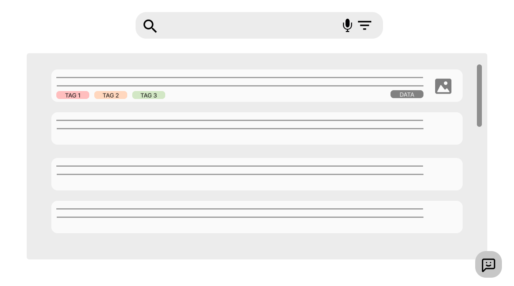
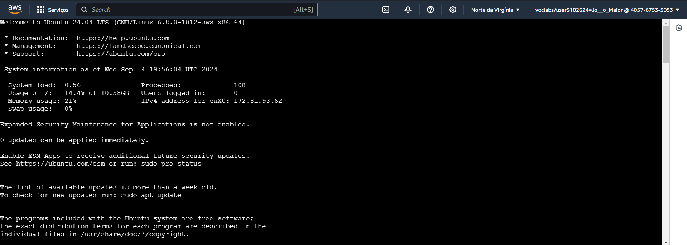

<table>
<tr>
<Table>
  <tr>
    <td><a href= "https://www.bankofamerica.com"></td>
    <td>
      <a href= "https://www.inteli.edu.br/"></a>
    </td>
  </tr>
</table>

# RegulA.I

## Integrantes:

- <a href="https://www.linkedin.com/in/eduarda-cardoso-de-souza-8bb802268/" target="_blank">Eduarda Cardoso de Souza</a>
- <a href="https://www.linkedin.com/in/henrique-ottoboni-magalhaes-tecnologia/" target="_blank">Henrique Ottoboni Magalhães</a>
- <a href="https://www.linkedin.com/in/joão-pedro-sotto-maior/" target="_blank">João Pedro Sotto Maior</a>
- <a href="https://www.linkedin.com/in/leandro-dos-santos-gomes/" target="_blank">Leandro dos Santos Gomes</a>
- <a href="https://www.linkedin.com/in/théo-tosto-7a0a9922b/" target="_blank">Théo Tosto</a>
- <a href="https://www.linkedin.com/in/thomasreitzfeld/" target="_blank">Thomas Reitzfeld</a>

## Sumário

- [1. Entendimento do Negócio](#1-entendimento-do-negócio)
  - [1.1 Indústria do Parceiro](#11-indústria-do-parceiro)
  - [1.2 Problema](#12-problema)
  - [1.3 Descrição da Solução](#13-descrição-da-solução)
  - [1.4 Proposta de Valor](#14-proposta-de-valor)
  - [1.5 Matriz de Risco](#15-matriz-de-risco)
  - [1.6 Matriz de Oportunidade](#16-matriz-de-oportunidades)
  - [1.7 Estimativa de Investimento](#17-estimativa-de-investimento)
- [2. Entendimento do Design](#2-entendimento-do-design)
  - [2.1 Estudo sobre o usuário do sistema](#21-estudo-sobre-o-usuário-do-sistema)
  - [2.2 Experiências do usuário ao utilizar o sistema](#22-experiências-do-usuário-ao-utilizar-o-sistema)
  - [2.3 Proposta de UX](#23-proposta-de-ux)
  - [2.4 Tecnologias Utilizadas](#24-tecnologias-utilizadas)
- [3. Entendimento da Arquitetura do Sistema](#3-entendimento-da-arquitetura-do-sistema)
  - [3.1 Desenho do Sistema](#31-desenho-do-sistema)
  - [3.2 Requisitos Funcionais](#32-requisitos-funcionais)
  - [3.3 Requisitos Não Funcionais](#33-requisitos-não-funcionais)
  - [3.4 Padrões de Trabalho](#34-padrões-de-trabalho)
- [4. Sistema de NLP](#4-sistema-de-nlp)
- [5. Documentação da Sprint 2](#5-documentação-da-sprint-2)
- [6. Construção do Backend da Solução](#6-construção-do-backend-da-solução)
- [7. Documentação da Sprint 3](#7-documentação-da-sprint-3)
- [8. Construção do Frontend da Solução](#8-construção-do-frontend-da-solução)
- [9. Documentação da Sprint 4](#9-documentação-da-sprint-4)
- [10. Elaboração da Documentação Final do Projeto](#10-elaboração-da-documentação-final-do-projeto)
- [11. Apresentação Final](#11-apresentação-final)

# 1. Entendimento do Negócio

## 1.1 Indústria do Parceiro

### 1.1.1 Contexto da Indústria

&emsp;O Bank of America opera na indústria de serviços financeiros, mais especificamente no setor bancário. O contexto da indústria em que o Bank of America se enquadra é caracterizado por ser um ambiente altamente regulado, competitivo e tecnologicamente avançado, onde a capacidade de inovar e se adaptar às mudanças é crucial para o sucesso contínuo.

&emsp;Dessa forma, o setor bancário é um dos maiores e mais importantes mercados, crucial para a economia global, visto que facilita a intermediação financeira, conectando poupadores e investidores, e fornecendo uma infraestrutura segura para transações financeiras.

&emsp;Dentro desse contexto, o Bank of America se destaca como um dos principais atores, inovando continuamente e fornecendo uma ampla gama de serviços financeiros que impulsionam o desenvolvimento econômico e atendem às diversas necessidades de seus clientes.

### 1.1.2 Modelo de Negócio

&emsp; Um modelo de negócio descreve como uma empresa cria valor, entrega esse valor aos clientes e gera receita. Ele inclui aspectos como a proposta de valor da empresa, os segmentos de clientes atendidos, os canais de distribuição utilizados, o relacionamento com os clientes, as fontes de receita, os recursos-chave necessários e as atividades-chave realizadas pela empresa.

&emsp; O Bank of America (BofA) opera com um modelo de negócio robusto e diversificado, estruturado em torno de três pilares principais. O primeiro deles é o Banco de Varejo, que oferece uma ampla gama de serviços financeiros para indivíduos e pequenas empresas, incluindo contas correntes, empréstimos, hipotecas e cartões de crédito. Vale ressaltar que, no que se refere aos serviços de varejo para pessoas físicas, o BofA opera exclusivamente nos Estados Unidos. Esse pilar é sustentado por uma extensa rede de agências, plataformas digitais e uma equipe dedicada a garantir que os clientes tenham acesso fácil e conveniente aos produtos e serviços do banco.

&emsp; O segundo pilar é o Banco de Atacado e Investimentos, onde o BofA atende grandes corporações, instituições financeiras, governos e clientes de alto patrimônio. Nessa área, o banco oferece serviços como fusões e aquisições, emissão de títulos, gestão de ativos e acesso aos mercados de capitais. Esse pilar é essencial para o BofA, pois permite ao banco estar presente nas transações financeiras mais complexas e de alto valor, consolidando sua posição como um dos líderes globais no setor.

&emsp; Por fim, o BofA investe fortemente em Inovação e Tecnologia, reconhecendo a importância de se manter à frente das tendências tecnológicas para oferecer soluções financeiras eficientes e seguras. Esse investimento inclui o desenvolvimento de plataformas digitais avançadas, o uso de inteligência artificial para personalização de serviços e a automação de processos para aumentar a eficiência operacional. Essas inovações não só melhoram a experiência do cliente, mas também permitem ao banco reduzir custos e aumentar sua competitividade no mercado global.

&emsp; Esses três pilares se complementam e reforçam a posição do Bank of America como uma das principais instituições financeiras do mundo, proporcionando uma oferta abrangente de produtos e serviços que atendem às necessidades de uma base diversificada de clientes em mais de 30 países.

### 1.1.3 Tendências

&emsp; O Bank of America, atuando no setor financeiro brasileiro, está inserido em um ambiente regulatório em constante evolução, com uma crescente demanda por conformidade diante de normas cada vez mais complexas e específicas.

&emsp; Nos últimos anos, observou-se uma intensificação das regulamentações voltadas para a prevenção de crimes financeiros, como lavagem de dinheiro, além de um foco ampliado em sustentabilidade e governança ambiental, social e corporativa (ESG). Além disso, há uma tendência de digitalização das operações bancárias e de inclusão de novas tecnologias financeiras (fintechs), o que exige do banco uma capacidade robusta de adaptação e inovação.

&emsp; Nesse contexto, a demanda por sistemas que automatizem e integrem a análise regulatória tem crescido exponencialmente, buscando não apenas a conformidade, mas também a otimização dos processos internos, a redução de custos e a mitigação de riscos operacionais. Essa necessidade se torna ainda mais premente com a expectativa de que as regulamentações continuem a aumentar em complexidade e em volume, impulsionando a demanda por soluções tecnológicas avançadas que garantam eficiência, precisão e agilidade no cumprimento das obrigações regulatórias.

### 1.1.4 Partes Interessadas

&emsp;Dentre os envolvidos no projeto, encontram-se:

- **Inteli - Instituto de Tecnologia e Liderança**: O instituto desempenha um papel fundamental como um dos _stakeholders_ ao contribuir para o desenvolvimento das competências dos alunos e estabelecer parcerias acadêmicas com o Bank Of America. Além disso, reforça sua reputação como uma entidade comprometida com a inovação e responsabilidade social ao participar deste projeto.

- **Grupo RegulA.I**: Como responsáveis pelo desenvolvimento e implementação da solução, o grupo RegulA.I é encarregado de criar uma plataforma que atenda às necessidades do Bank of America.

- **Bank of America (BofA)**: Como a entidade que solicitou a solução, o Bank of America é um dos _stakeholders_ centrais, sendo o usuário final da solução tecnológica que visa otimizar o processo de acompanhamento de mudanças regulatórias. Através desse projeto, o BofA busca fortalecer sua conformidade regulatória, reduzir riscos operacionais e aprimorar sua eficiência no Brasil.

## 1.2 Problema

&emsp; O Bank of America enfrenta desafios complexos na gestão das mudanças regulatórias no Brasil devido à diversidade, volume e complexidade das normas emitidas por 17 diferentes órgãos reguladores. Cada regulador utiliza métodos distintos e não padronizados para divulgar novas regulamentações, o que dificulta a interpretação e a aplicação dessas normas. A falta de padronização entre os reguladores exige que os analistas regulatórios se adaptem constantemente a diferentes formatos e conteúdos, resultando em um processo trabalhoso e suscetível a erros. Este cenário sobrecarrega os analistas e gestores de compliance, elevando o risco de não conformidade, o que pode impactar negativamente o banco tanto operacionalmente quanto em termos de reputação. Uma solução automatizada é essencial para reduzir o tempo de análise, melhorar a precisão das informações e garantir a conformidade contínua com as regulamentações.

## 1.3 Descrição da Solução

&emsp; A solução consiste em uma aplicação web que automatiza a coleta, filtragem e indexação de regulamentações para o Bank of America, utilizando técnicas de _web scraping_, modelos de LLM (Large Language Model) e PLN (Processamento de Linguagem Natural).

&emsp;O _web scraping_ é a técnica usada para extrair automaticamente informações de sites oficiais. Após a extração, um modelo de LLM filtra e categoriza às leis aplicáveis ao banco. Em seguida, O PLN é então aplicado para aprimorar a compreensão e a organização das informações.

&emsp; O sistema realiza a extração diária de novas leis dos sites oficiais da instituição regulatórias B3, categoriza e filtra as que são aplicáveis ao banco, e as armazena em uma base de conhecimento centralizada.

&emsp; Além disso, uma barra de pesquisa é implementada para facilitar a consulta dessas informações, permitindo que analistas e gestores acessem rapidamente dados relevantes e atualizados, promovendo maior eficiência operacional e conformidade regulatória.

## 1.4 Proposta de Valor

&emsp; O Canvas de Proposta de Valor é uma ferramenta visual poderosa utilizada para alinhar de forma estratégica a proposta de uma solução às necessidades e expectativas dos clientes. Ele é composto por dois blocos principais, que correspondem às duas metades do template.

&emsp; No lado direito do Canvas, que corresponde ao círculo, focamos no segmento de clientes. Aqui, identificamos e descrevemos as tarefas que os clientes precisam realizar (Customer Jobs), os problemas e desafios que enfrentam (Pains), e os benefícios que esperam alcançar (Gains). Esse mapeamento detalhado é crucial para entender o contexto em que os usuários operam e as dificuldades específicas que eles enfrentam no dia a dia.

&emsp; No lado esquerdo, que corresponde ao quadrado, encontramos a proposta de valor. Esse bloco é dedicado a descrever os produtos e serviços oferecidos pela solução, destacando como eles aliviam as dores dos clientes (Pain Relievers) e criam os benefícios esperados (Gain Creators). Este lado do Canvas é fundamental para garantir que a solução desenvolvida esteja em perfeita sintonia com as necessidades dos usuários, proporcionando-lhes valor real e tangível.

&emsp; Ao utilizar o Canvas de Proposta de Valor neste projeto específico para o Bank of America, que envolve a criação de uma solução tecnológica para otimizar o acompanhamento de mudanças regulatórias, podemos garantir que cada aspecto do desenvolvimento está direcionado para resolver problemas específicos dos Compliance Officers. Através dessa ferramenta, o projeto é orientado para maximizar a relevância e a eficácia da solução, alinhando perfeitamente a tecnologia às demandas do setor financeiro.

&emsp; A seguir, o Canvas Proposta de Valor:

<h6 align="center"> Figura 1: Canvas Proposta de Valor </h6>


<h6 align="center"> Fonte: Material produzido pelos autores (2024) </h6>

&emsp; A partir disso, segue uma breve descrição e explicação dos tópicos exibidos na imagem acima:

&emsp; No contexto do projeto, as tarefas dos clientes (Costumer Jobs) incluem o monitoramento e implementação de Normas Reguladoras e garantir a conformidade com regulamentações financeiras complexas e diversificadas. Além disso, também incluem a redução dos riscos regulatórios. Já os principais desafios enfrentados pelos clientes incluem a complexidade e diversidade do ambiente regulatório brasileiro, o risco de não conformidade devido à falha na captura ou implementação de novas normas e, além disso, o alto custo operacional para monitorar mudanças regulatórias manualmente.

&emsp; Os ganhos (gains) esperados para os clientes incluem a agilidade e precisão no acompanhamento das mudanças regulatórias, a redução dos custos operacionais e dos riscos de não conformidade e a melhoria na alocação de recursos para atividades mais estratégicas. Já à esquerda da imagem há a proposta de valor, sendo composta primeiramente pelos Produtos e Serviços (Products & Services), a qual é uma solução técnológica automatizada para captura, classificação e consulta de regulamentações financeiras. Além disso, há o uso de processamento de linguagem natural (PLN) para facilitar a interação e classificação das normas. Os aliviadores de ganhos (Pain Relievers) são a automatização do processo de monitoramento e captura das novas regulamentações, redução significativa dos riscos associados ao não cumprimento das regulamentações e o aumento da eficiência operacional, permitindo que os recursos sejam melhor alocados.

&emsp; Por fim, os criadores de ganhos (Gain creators) incluem o monitoramento diário e centralizado das LRRs, com acesso simplificado; consulta de regulamentações utilizando comandos em linguagem natural e a classificação automática e precisa das normas com base em critérios pré-definidos. Desse modo, finalizando o Canvas Proposta de Valor.

## 1.5 Matriz de Risco

&emsp; De início, é válido destacar o conceito de matriz de risco. Isto é: uma ferramenta visual que auxilia na identificação e priorização dos riscos de um projeto. Para representar essa prioridade dos riscos, utilizamos cores para marcar a probabilidade e o impacto de tal risco acontecer, sendo classificados em baixo, médio ou alto. Por outro lado, a matriz também pode destacar as oportunidades para o projeto, também dividido em probabilidade e impacto, assim como em alto, baixo ou médio.

&emsp; Seguindo este conceito, cita-se abaixo a matriz de risco do grupo RegulA.I:

<h6 align="center"> Figura 2: Matriz de risco </h6>


<h6 align="center"> Fonte: Material produzido pelos autores (2024) </h6>

&emsp; Para cada risco, um plano de ação para superá-lo caso ocorra durante o desenvolvimento do projeto:

- **O grupo ter dificuldade na utilização e ambientação com as tecnologias utilizadas neste projeto**: classificado como um risco de probabilidade alta e impacto baixo, a equipe RegulA.I buscará ajuda de colegas e professores, bem como cursos online e fóruns a fim de compreender tais tecnologias para então desenvolver um bom projeto.

- **Identificação inconsistente de novas “LRRs” (Laws, Rules and Regulations)**: classificado como um risco de probabilidade alta e impacto médio, o grupo trabalhará com assertividade para que haja um monitoramento constante das novas LRRs. Será estabelecido um processo de revisão semanal das leis e regulamentos pertinentes ao projeto, utilizando bases de dados confiáveis e consultoria especializada, se necessário.

- **Comandos de consulta em linguagem natural não funcionais**: classificado como um risco de probabilidade alta e impacto alto, a equipe buscará desenvolver ferramentas que permitam consultas manuais ou comandos alternativos caso os comandos de linguagem natural falhem. Além disso, será realizado um trabalho intensivo de testes e refinamento dos algoritmos de processamento de linguagem natural.

- **Usuários não adaptados à plataforma**: classificado como um risco de probabilidade média e impacto baixo, o grupo construirá um sistema que seja bastante simples e intuitivo para os usuários, visando uma plataforma direta e autoexplicativa para o usuário final. Serão criados tutoriais e guias de uso para facilitar a adaptação dos usuários.

- **Software utilizado apresentando falhas técnicas**: classificado como um risco de probabilidade média e impacto médio, a equipe desenvolverá um sistema em que terá bastante assertividade e conexão em todas as partes a fim de entregar uma solução final correta. Serão implementados testes automáticos e uma estratégia de monitoramento contínuo para identificar e corrigir falhas técnicas rapidamente

- **Divisão inadequada da equipe em funções do projeto**: classificado como um risco de probabilidade média e impacto alto, o grupo, juntamente com a orientação dos professores, dividirá de maneira adequada todas as tarefas a fim de não sobrecarregar um indivíduo e, além disso, contribuir com o aprendizado igualitário, fazendo com que todos passem por todas as áreas. Serão realizadas constantes reuniões para reavaliar a distribuição de tarefas e fazer ajustes conforme necessário.

- **Alteração no software e no design escolhido para o projeto**: classificado como um risco de probabilidade baixa e impacto baixo, a equipe estabelecerá um processo de controle de mudanças que inclui a documentação detalhada de todas as alterações propostas, avaliação do impacto potencial e aprovação por todos os membros do grupo antes de implementação. Isso minimizará surpresas e garantirá que todos estejam cientes e concordam com as mudanças.

- **Ausência de um integrante do grupo**: classificado como um risco de probabilidade baixa e impacto médio, o grupo está bem unido, com todas as tarefas bem divididas e sempre adiantadas, para caso alguém fique impossibilitado de realizar sua função, outra pessoa pode desenvolver.

- **Sistema não suportar diferentes tipos de arquivos**: classificado como um risco de probabilidade baixa e impacto alto, a equipe definirá os tipos de arquivos que precisam ser suportados desde o início e realizará testes exaustivos para garantir compatibilidade. Poderá ser desenvolvido um plano de contingência para converter ou processar arquivos não suportados utilizando ferramentas externas ou módulos adicionais, se necessário.

## 1.6 Matriz de Oportunidades

&emsp; Assim como a matriz de risco desenvolvida, a equipe RegulA.I trabalhou no desenvolvimento da matriz de oportunidades.

<h6 align="center"> Figura 3: Matriz de oportunidades </h6>


<h6 align="center"> Fonte: Material produzido pelos autores (2024) </h6>

&emsp; Desse modo, cita-se em forma de lista as oportunidades que o grupo poderá ter no decorrer deste módulo:

- **Integrantes do grupo em harmonia no desenvolvimento do projeto**: uma boa relação entre a equipe é fundamental para o sucesso do projeto. Quando os integrantes trabalham em harmonia, há uma comunicação mais eficaz, menos conflitos, e uma colaboração mais fluida. Isso resulta em maior eficiência e qualidade nas entregas.

- **Bank of America divulgar novas informações e feedbacks que auxiliarão na construção e melhoria do sistema**: receber feedbacks contínuos do Bank of America permite que a equipe ajuste e melhore o sistema conforme necessário. Informações atualizadas e críticas construtivas ajudam a alinhar o desenvolvimento às expectativas e necessidades reais do banco, aumentando a relevância e a aplicabilidade do projeto.

- **Equipe aprimorar os conhecimentos em linguagem natural, arquitetura de sistemas e gestão de equipe**: este projeto proporciona uma oportunidade para a equipe desenvolver habilidades técnicas e de gestão. Aprofundar conhecimentos em áreas como linguagem natural, arquitetura de sistemas e gestão de equipe não só beneficia o projeto atual, mas também enriquece o desenvolvimento profissional dos integrantes.

- **Usuários se adaptarem com facilidade na plataforma**: uma plataforma intuitiva e fácil de usar resulta em uma adoção mais rápida e menos resistência por parte dos usuários. Isso também reduz a necessidade de suporte contínuo e aumenta a satisfação do usuário, criando uma base sólida para o sucesso do sistema a longo prazo.

- **Realizar apresentações na instituição e contatar profissionais da área em questão do Bank of America a fim de compreender de maneira mais abrangente o problema presente**: apresentações e interações com profissionais experientes oferecem insights valiosos e um entendimento mais profundo do problema a ser resolvido. Essas oportunidades de networking também podem abrir portas para colaborações futuras e enriquecer a experiência acadêmica e profissional dos membros da equipe.

- **Experiência agradável e funcional para o usuário final**: garantir que o usuário final tenha uma experiência positiva é crucial para o sucesso de qualquer sistema. Um design funcional e agradável aumenta a usabilidade, promove a lealdade dos usuários e pode gerar boas referências, fortalecendo a reputação da equipe e do projeto.

- **Ajuda externa de colegas com a utilização das tecnologias utilizadas no projeto**: a colaboração com outros alunos e colegas pode trazer novas perspectivas e soluções inovadoras. Esta ajuda externa pode acelerar a curva de aprendizado e a resolução de problemas, contribuindo para um desenvolvimento mais eficaz e eficiente do projeto.

- **Fortalecer a parceria entre o Bank of America e Inteli**: um projeto bem-sucedido pode fortalecer os laços entre a instituição acadêmica e o Bank of America. Essa parceria pode resultar em mais oportunidades de colaboração, financiamentos futuros e um maior reconhecimento para ambos os lados.

- **Oportunidades futuras de estágios**: participar de um projeto em colaboração com uma grande instituição como o Bank of America pode abrir portas para oportunidades de estágio. Essas oportunidades proporcionam uma experiência prática valiosa e podem ser o primeiro passo para uma carreira promissora no setor financeiro ou tecnológico.

&emsp; Assim, fechando a matriz de oportunidades.

## 1.7 Estimativa de Investimento

&emsp; Ao desenvolver o RegulA.I. para a gestão das mudanças regulatórias no Bank of America, a elaboração de uma estimativa de investimento se torna crucial. Este planejamento financeiro garante a viabilidade do projeto e direciona a alocação eficiente de recursos. Dada a complexidade de monitorar e integrar os diversos regulamentos emitidos por 17 reguladores diferentes, compreender os custos envolvidos é fundamental para o sucesso e sustentabilidade do projeto.

### Viabilidade da Solução

&emsp; A solução RegulA.I. automatizará o monitoramento e a extração de dados dos sites reguladores, reduzindo drasticamente a carga de trabalho manual e minimizando o risco de erros humanos. A arquitetura escalável do sistema permite a adaptação a novas exigências regulatórias e a integração de novos órgãos reguladores sem comprometer a performance.

&emsp; A automatização do processo também resultará em uma significativa redução dos custos operacionais, ao diminuir a dependência de trabalho manual intensivo.

### Desenvolvedores

&emsp; A equipe de desenvolvimento é essencial para construir, testar e manter o RegulA.I. Eles são responsáveis pela codificação, integração de sistemas, correção de bugs, manutenções e atualizações futuras.

&emsp; O custo depende do número de pessoas necessárias, suas localizações geográficas, suas habilidades e a duração do projeto. Considerando que o desenvolvimento inicial do RegulA.I. será realizado por 6 desenvolvedores juniores e um *product owner* durante 10 semanas no Brasil, a seguinte estimativa é feita para este período e nessas condições:

<div align="center">
  <sub>Tabela 1: Gastos desenvolvedores I</sub>

| Cargo | Salário Mensal | Período (meses) | Quantidade de Pessoas | Valor Total  |
|-------|----------------|-----------------|-----------------------|--------------|
| Desenvolvedor Júnior| R$ 3.833,00 | 2,5 | 6 | R$ 57.495,00 |
| Product Owner      | R$ 10.100,00 | 2,5 | 1 | R$ 25.250,00 |

 <sup>Fonte: Elaborado por RegulA.I. </sup>

</div>

&emsp; Os salários utilizados nesta análise foram obtidos do site Glassdoor para as profissões analisadas:

- [Desenvolvedor Júnior](https://www.glassdoor.com.br/Salários/desenvolvedor-junior-salário-SRCH_KO0,20.htm)
- [Product Owner](https://www.glassdoor.com.br/Salários/product-owner-salário-SRCH_KO0,13.htm)

&emsp; Somando esses valores, durante 2,5 meses, o que equivale a aproximadamente 10 semanas, seriam gastos R$ 82.745,00 com a equipe para o desenvolvimento da aplicação.

&emsp; Para concluir esse cálculo, é necessário analisar os 9,5 meses restantes (completando a estimativa de 12 meses), que serão dedicados às manutenções do sistema. Utilizando como estimativa três desenvolvedores juniores para dar continuidade ao trabalho, podemos calcular os gastos restantes da seguinte maneira:

<div align="center">
  <sub>Tabela 2: Gastos desenvolvedores II</sub>

| Cargo | Salário Mensal | Período (meses) | Quantidade de Pessoas | Valor Total  |
|-------|----------------|-----------------|-----------------------|--------------|
| Desenvolvedor Júnior| R$ 3.833,00 | 9,5 | 3 | R$ 109.240,50  |

 <sup>Fonte: Elaborado por RegulA.I. </sup>

</div>

&emsp; Portanto, o valor gasto com desenvolvedores durante os 12 meses, incluindo o desenvolvimento inicial e a manutenção, seria em torno de R$ 191.985,50.

### Infraestrutura

&emsp; A infraestrutura desempenha um papel crucial no sucesso de qualquer projeto tecnológico, e no caso do RegulA.I., a escolha da Amazon Web Services (AWS) foi estratégica. Utilizando os serviços da AWS, o projeto se beneficia de uma infraestrutura de nuvem escalável e flexível, que se adapta às necessidades crescentes dos usuários e da demanda por dados.

&emsp; Entre os principais serviços utilizados estão o Amazon EC2, para computação, e o Amazon RDS, para gerenciamento de bases de dados. Esses serviços não apenas garantem o desempenho e a disponibilidade do aplicativo, mas também permitem otimizar os custos através de um modelo de pagamento conforme o uso, que é significativamente mais econômico do que manter uma infraestrutura local própria.

&emsp; Para calcular os gastos relacionados à instância EC2 e ao banco de dados RDS, é possível utilizar a ferramenta da própria AWS. Essa ferramenta calcula o valor do custo com base na necessidade do projeto. No contexto do RegulA.I., a tabela abaixo representa os gastos necessários para a execução da aplicação durante 12 meses:

<div align="center">
  <sub>Tabela 3: Gastos Serviços AWS</sub>

| Serviço | Preço mensal | Período (meses) | Quantidade | Valor Total  |
|-------|----------------|-----------------|-----------------------|--------------|
| Instância EC2 | US$ 1.472,92 | 12 | 1 | US$ 17.675,04 |
| Banco de Dados RDS| US$ 525,50 | 12 | 1 | US$ 6.306,00 |

  <sup>Fonte: Elaborado por RegulA.I.</sup>

</div>

&emsp; Foi utilizado o [AWS Pricing Calculator](https://drive.google.com/file/d/1VrBDldPnv3CM1PEV1lT6ZPSLwHJzWj3d/view?usp=sharing) para calcular os valores estimados dos serviços.

&emsp; Podemos observar que ao longo de um ano, o valor total do serviço da Amazon fica em US\$ 23.981,04. Traduzindo esse preço para o real com a cotação do dólar em 16/08/2024, obtemos aproximadamente **R$ 131.416,10**.

### Conclusão

&emsp; A análise dos custos envolvidos no desenvolvimento e manutenção do RegulA.I. ao longo de 12 meses demonstra um investimento cuidadosamente planejado. O custo com a equipe de desenvolvimento, incluindo o trabalho inicial e a manutenção, totaliza aproximadamente **R$ 191.985,50**.

&emsp; Além disso, a escolha da Amazon Web Services (AWS) para a infraestrutura garante a escalabilidade e flexibilidade necessárias, com um custo estimado de **R$ 131.416,10** ao longo de um ano.

&emsp; Somando esses valores, o investimento total para o primeiro ano de operação do RegulA.I. é de aproximadamente **R$ 323.401,60** refletindo um compromisso com a eficiência e a sustentabilidade do projeto.

# 2. Entendimento do Design

## 2.1 Estudo sobre o usuário do sistema

&emsp; Para desenvolver uma solução tecnológica eficaz para o setor de compliance do Bank of America, é essencial compreender profundamente as necessidades, comportamentos e expectativas dos usuários finais. Esse entendimento guiará o design do sistema, garantindo que ele seja intuitivo, funcional e alinhado com as tarefas críticas desempenhadas pelos analistas de compliance.

### Identificação do Usuário Final
&emsp; **Analistas de Compliance**: O sistema será utilizado principalmente por analistas de compliance, cuja função central é garantir que o Bank of America esteja sempre em conformidade com as normas regulatórias vigentes. Estes profissionais têm a responsabilidade de identificar e interpretar novas regulamentações, e de implementar as mudanças necessárias para manter a conformidade do banco.

### Necessidades e Objetivos
 - **Monitoramento Eficiente das Mudanças Regulatórias**: Esses analistas precisam de uma ferramenta que facilite a rápida identificação e compreensão de novas leis e regulamentações que possam impactar o banco. O sistema deve permitir uma visão clara e organizada das mudanças, destacando aquelas mais relevantes para as operações do Bank of America.
   
 - **Automatização e Precisão**: A automatização na classificação, tagueamento e organização das regulamentações é altamente valorizada. Reduzir o trabalho manual não só aumenta a eficiência, mas também minimiza o risco de erros, garantindo que os analistas possam focar nas tarefas de maior valor agregado.
   
 - **Alerta Proativo**: Os analistas necessitam de um sistema que forneça alertas proativos e personalizados sobre novas regulamentações, permitindo que respondam rapidamente a qualquer mudança que possa impactar as operações do banco.

### Preferências e Habilidades
 - **Experiência com Sistemas de Compliance**: Embora os analistas de compliance estejam familiarizados com plataformas tecnológicas, suas habilidades técnicas podem variar. Portanto, o sistema deve ser acessível para usuários com diferentes níveis de experiência, com uma interface intuitiva e fácil de aprender.
   
 - **Navegação e Usabilidade**: Os usuários preferem uma interface que seja lógica e eficiente, com opções de busca rápida e organização clara das informações. Ferramentas de busca avançada, incluindo a utilização de linguagem natural, serão particularmente úteis para facilitar a localização de informações específicas.

### Contexto de Uso

&emsp; **Ambiente Corporativo de Alta Pressão**: Os analistas de compliance operam em um ambiente onde a conformidade regulatória é crítica e os prazos são frequentemente apertados. O sistema deve, portanto, suportar um uso intensivo e contínuo, oferecendo alta confiabilidade e velocidade de resposta. Além disso, deve integrar-se perfeitamente com outras ferramentas corporativas e fluxos de trabalho existentes para minimizar interrupções e maximizar a produtividade.

### Conclusão

&emsp; O sistema será uma ferramenta essencial para os analistas de compliance, projetada para facilitar a identificação, análise e implementação de mudanças regulatórias de maneira eficiente e precisa. Com uma interface intuitiva, funcionalidades automatizadas, e opções de customização, o sistema permitirá que os profissionais de compliance desempenhem suas funções com maior eficácia, contribuindo para a segurança e a conformidade operacional do Bank of America. A solução não só suportará as operações diárias, mas também fortalecerá a capacidade do banco de responder rapidamente a um ambiente regulatório em constante mudança.
  
## 2.2 Experiências do usuário ao utilizar o sistema

&emsp; Com base no estudo realizado e nos mockups apresentados, foram identificadas as principais experiências que o usuário deverá vivenciar ao utilizar o sistema. Esta análise é essencial para garantir que o sistema atenda às necessidades e expectativas dos usuários, proporcionando uma experiência fluida e eficaz. A seguir, detalham-se as etapas e os pontos de contato importantes ao longo da interação do usuário com o sistema.

### Primeira Interação e Familiarização

&emsp; Na primeira interação com o sistema, o usuário deve encontrar uma interface amigável e intuitiva. A organização clara das funcionalidades, com botões, menus e opções de busca bem visíveis, deve permitir que o usuário entenda rapidamente como navegar pelo sistema. Essa abordagem inicial é crucial para construir a confiança do usuário, facilitando sua adaptação e incentivando o uso contínuo.

### Consulta e Visualização de Leis

&emsp; Ao acessar a tela de consulta de leis, o usuário deve vivenciar uma experiência onde as informações são apresentadas de forma organizada e acessível. A interface deverá exibir uma lista cronológica das leis, com detalhes como título, data de publicação e status de vigência. A experiência de navegação será aprimorada por filtros e uma barra de pesquisa, permitindo que o usuário encontre rapidamente as leis específicas de seu interesse.

### Navegação e Filtragem de Conteúdo

&emsp; O sistema oferecerá ferramentas avançadas de navegação e filtragem para ajudar o usuário a identificar rapidamente as leis relevantes. A possibilidade de aplicar filtros por data, tema, e status, além da navegação por tags, permitirá uma experiência de busca eficiente e direcionada. Essas funcionalidades devem garantir que o usuário consiga acessar informações cruciais sem complicações.

### Interação com o a barra de pesquisa

&emsp; Um dos principais destaques da experiência do usuário será a interação com a barra de pesquisa, que permitirá que o usuário faça perguntas em linguagem natural sobre as leis e obtenha respostas imediatas baseadas em consultas SQL. A experiência deve ser fluida, oferecendo links para leis ou detalhes específicos, conforme necessário. A capacidade de entender perguntas complexas e fornecer respostas adequadas é essencial para a eficácia desta ferramenta.

### Eficiência e Produtividade

&emsp; A utilização do sistema deverá trazer um aumento perceptível na eficiência e produtividade do processo de regulamentação como um todo. A facilidade de acesso as leis, aliada à capacidade de realizar consultas rápidas por meio da barra de pesquisa, permitirá ao usuário completar suas tarefas de forma mais rápida e precisa. A navegação fluida reforça essa experiência, garantindo que o usuário não perca tempo com processos desnecessários.

### Conclusão

&emsp; A análise da experiência do usuário no sistema revela um ambiente que não só atende às necessidades funcionais dos usuários, mas também se preocupa com a usabilidade e a satisfação geral. Desde a primeira interação até a consulta de informações detalhadas, o sistema foi projetado para ser intuitivo e eficiente. Essas características asseguram uma experiência positiva, melhorando a produtividade e otimizando o processo regulatório do banco.

## 2.3 Proposta de UX

&emsp; A proposta de UX foi desenvolvida com o objetivo de criar uma aplicação simples, de fácil uso, e que auxilie a equipe do Bank of America a adquirir informações regulatórias de maneira eficiente e descomplicada. Buscamos uma interface intuitiva que prioriza a facilidade de navegação e o acesso rápido às regulamentações relevantes.

&emsp; Desenvolvemos um wireframe para ilustrar visualmente os propósitos da nossa interface, com foco na simplicidade e eficiência. O objetivo da proposta é garantir que os usuários possam acessar informações rapidamente, com um feedback visual claro e preciso, enquanto o chatbot oferece suporte imediato sempre que necessário.

&emsp; A seguir, serão apresentados e detalhados os principais componentes da página, destacando como cada elemento contribui para uma experiência de usuário fluida e intuitiva.

## Tela Principal

&emsp; A tela principal oferece uma visão geral clara e acessível das regulamentações, facilitando a busca e o acesso às informações necessárias. Ela foi projetada para proporcionar uma experiência de usuário fluida, com uma interface intuitiva que destaca a importância da simplicidade e eficiência na navegação.

<div style="text-align: center">Figura 4 - Wireframe Tela Principal</div>

<div style="text-align: center">Fonte: Material produzido pelos autores (2024)</div>

### Componentes

- **Barra de Pesquisa**: Localizada na parte superior da tela, a barra de pesquisa permite que os usuários digitem palavras-chaves para buscar regulamentações específicas.

- **Lista de Regulamentações**: Abaixo da barra de pesquisa, a lista exibe as regulamentações mais relevantes, filtradas com base na consulta. Cada item na lista mostra o título da regulamentação, uma breve disposição e a data de publicação, além de tags que a identifiquem.

- **Botão de Chatbot**: Um botão de chatbot fixado no canto inferior direito da tela. Ele deve ser sempre visível, permitindo que os usuários acessem o chatbot a qualquer momento.

### Interações

- **Ao clicar em um Item da Lista**: Um popup é exibido com informações detalhadas sobre a regulamentação selecionada. O popup inclui o título completo, o tema, um resumo mais detalhado e a opção de baixar o regulamento em formado PDF. O design do popup deve ser claro, com um botão de fechamento fácil de identificar.

Abaixo está a representação do popup de informações:

<div style="text-align: center">Figura 5 - Wireframe Pop-up Informações</div>

<div style="text-align: center">Fonte: Material produzido pelos autores (2024)</div>
<br>

- **Ao Clicar no Botão de Chatbot**: Um popup de chatbot é aberto, ocupando uma parte da tela, permitindo que o usário interaja com o chatbot para consultas adicionais. O chatbot deve ser capaz de responder a perguntas sobre as regulamentações, fornecer informações contextuais e direcionar o usuário para os regulamentos relevantes.

Abaixo está a representação do popup de informaçõe do chatbot:

<div style="text-align: center">Figura 6 - Wireframe Pop-up Chatbot</div>

<div style="text-align: center">Fonte: Material produzido pelos autores (2024)</div>

### Considerações Finais

&emsp; A proposta de UX é um design consistente, com cores, tipografia e espaçamento que ajudem a criar uma experiência de usuário agradável e sem distrações.

&emsp; Essa estrutura visa criar uma experiência fluida, em que a busca e consulta de regulamentações sejam simples e rápidas, e o chatbot funcione como um suporte adicional para navegação e esclarecimento de dúvidas.

## 2.4 Tecnologias Utilizadas

&emsp; No desenvolvimento deste projeto, a escolha das tecnologias foi guiada pela necessidade de criar uma solução eficiente, escalável e robusta para otimizar o processo de acompanhamento de mudanças regulatórias na indústria financeira.

&emsp; Abaixo, estão listadas as tecnologias escolhidas, juntamente com uma breve descrição de como e onde serão utilizadas, além das justificativas para suas seleções.

### Frontend: Next.js

&emsp; Next.js é um framework de React para desenvolvimento de aplicações web e websites. Ele permite renderização no lado do servidor (SSR) e geração estática de sites, o que melhora o desempenho e a SEO das páginas web.

&emsp; O Next foi escolhido por sua facilidade de uso, eficiência em renderização e suporte robusto para funcionalidades modernas, permitindo o desenvolvimento rápido e eficaz do frontend.

**Utilização**:

- **Construção da Interface de Usuário**: As páginas e componentes da aplicação serão desenvolvidos com o Next, aproveitando suas características para uma experiência de navegação fluida.

- **Integração com APIs**: O Next.js facilitará a integração com APIs do backend, garantindo que os dados sejam exibidos de forma eficiente e em tempo real.

### Backend e Processamento de Linguagem Natural: Python

&emsp; Python é uma linguagem de programação de alto nível, conhecida por sua simplicidade e legibilidade. É amplamente utilizada em ciência de dados, automação e desenvolvimento de software.

&emsp; A escolha do Python deve-se à sua flexibilidade e ao extenso conjunto de bibliotecas para PLN (Processamento de Linguagem Natural) e automação, facilitando a manipulação e análise de grandes volumes de dados regulatórios.

**Utilização**:

- **Captura e Classificação de Regulamentos**: Python será usado para desenvolver scripts que capturam regulamentos de diferentes fontes, categorizando-os e armazenando-os adequadamente.

- **Processamento de Linguagem Natural**: Técnicas avançadas de PLN serão aplicadas para identificar a intenção e classificar os regulamentos. Isso inclui a utilização de modelos de linguagem de grande porte (LLMs) como GPT da OpenAI ou Llama da Meta.

- **Pipelines de ETL**: Desenvolvimento de pipelines para extrair, transformar e carregar dados, garantindo a integração eficiente dos dados regulatórios.

### Modelos de Linguagem de Grande Porte (LLMs): GPT da OpenAI ou Llama da Meta

&emsp; Os Modelos de Linguagem de Grande Porte (LLMs) são algoritmos avançados de aprendizado de máquina que entendem e geram texto de forma natural. O GPT (Generative Pre-trained Transformer) da OpenAI e o Llama da Meta são exemplos de LLMs que oferecem capacidades avançadas de processamento de linguagem.

&emsp; Esses modelos foram escolhidos devido à sua capacidade de compreender e gerar texto com alta precisão, o que é essencial para o processamento avançado e a organização de dados regulatórios.

**Utilização**:

- **Identificação de Intenção**: Os LLMs serão aplicados para interpretar e identificar a intenção por trás dos textos regulatórios, auxiliando na categorização e análise.

- **Tagueamento de Novas Leis**: Serão usados para gerar metadados e tags automáticas que facilitam a organização e pesquisa dos regulamentos.

### Banco de Dados: PostgreSQL

&emsp; PostgreSQL é um sistema de gerenciamento de banco de dados relacional (SGBD) de código aberto que suporta uma ampla gama de tipos de dados e é conhecido por sua robustez e conformidade com os padrões SQL.

&emsp; O PostgreSQL foi escolhido pela sua capacidade de lidar com dados complexos e sua confiabilidade em manter a integridade dos dados, além de seu suporte a operações avançadas e escalabilidade.

**Utilização**:

- **Armazenamento de Dados Regulatórios**: Será utilizado para armazenar os regulamentos capturados e processados, incluindo metadados, classificações, e resultados do processamento de linguagem natural.

**Gerenciamento de Pipelines de ETL**: PostgreSQL será parte integrante dos pipelines de ETL desenvolvidos em Python, garantindo que os dados extraídos e transformados sejam carregados de forma eficiente e organizada.

**Consultas e Relatórios**: O banco de dados permitirá consultas complexas e geração de relatórios sobre o cumprimento de regulamentações, facilitando o monitoramento e a tomada de decisões.

### Infraestrutura na Nuvem: AWS (Amazon Web Services)

&emsp; Amazon Web Services (AWS) é uma plataforma de computação em nuvem que oferece uma ampla gama de serviços, incluindo computação, armazenamento, e banco de dados, entre outros.

&emsp; AWS foi escolhida pela sua robustez, escalabilidade e ampla gama de serviços que suportam a infraestrutura necessária para o projeto, garantindo eficiência, segurança e flexibilidade no gerenciamento da aplicação.

**Utilização**:
**Hospedagem da Aplicação**: AWS será utilizada para hospedar o frontend e o backend da aplicação. Especificamente, a AWS EC2 (Elastic Compute Cloud) será empregada para fornecer a infraestrutura necessária, garantindo alta disponibilidade e escalabilidade.

**Gerenciamento do Banco de Dados**: AWS RDS (Relational Database Service) será usado para gerenciar o PostgreSQL, facilitando a configuração e a manutenção do banco de dados.

&emsp; As tecnologias selecionadas para este projeto têm o objetivo de oferecer uma solução eficiente e escalável para o acompanhamento de mudanças regulatórias. Com essas escolhas, garantimos que a aplicação atenderá às necessidades do Bank of America com disponibilidade e desempenho otimizado.

# 3. Entendimento da Arquitetura do Sistema

&emsp; Nesta sessão, apresentaremos o desenho de um sistema voltado para a coleta, processamento e visualização de leis, utilizando técnicas de "web scraping", PLN (Processamento de Linguagem Natural) e LLM (Large Language Model). O sistema é dividido em frontend e backend, cada um com responsabilidades distintas, garantindo uma abordagem organizada e eficiente para atender aos requisitos funcionais e não funcionais (RFs e RNFs) definidos.

## 3.1 Desenho do Sistema

<div align="center">
  <p>Imagem 7 - Desenho do sistema</p>
  
  <p>Fonte: Material produzido pelos autores (2024)</p>
</div>

&emsp; O sistema é composto por dois grandes blocos: frontend e backend. No frontend, os principais requisitos funcionais são a visualização de todas as leis (RF01) e a pesquisa por leis utilizando linguagem natural (RF02). Esses módulos interagem diretamente com o usuário, fornecendo uma interface intuitiva para acessar e pesquisar informações através de linguagem natural. O frontend será desenvolvido utilizando Next.js, um framework React que facilita a criação de páginas estáticas.

&emsp; No backend, temos três componentes principais: coleta das leis, processamento dos dados e busca no banco. A coleta das leis é feita via web scraping utilizando Python (RF03), onde as informações são extraídas de diversas fontes online. Em seguida, no módulo de processamento dos dados, ocorre o tagueamento das leis (RF04) e a extração de informações-chave de cada norma para seu armazenamento. Este processamento é realizado com o auxílio de Modelos de Linguagem de Grande Porte (LLMs), como o GPT da OpenAI ou Llama da Meta, que automatizam a categorização e extração de informações relevantes. Após o processamento, as leis são armazenadas no banco de dados PostgreSQL (RF05).

&emsp; Por fim, o componente de busca no banco, através de LLMs, realiza a geração de queries SQL para recuperar as informações solicitadas pelo frontend, evitando alucinações e garantindo que os resultados sejam precisos e relevantes. Toda a aplicação, incluindo o backend e o banco de dados, será hospedada na Amazon Web Services (AWS), utilizando serviços como AWS EC2 para hospedagem e AWS RDS para o gerenciamento do banco de dados PostgreSQL.

## 3.2 Requisitos Funcionais

&emsp; Os requisitos funcionais definem as funcionalidades e comportamentos específicos que um sistema deve ter para atender às necessidades dos usuários. Eles garantem que o sistema execute as tarefas essenciais conforme esperado.

&emsp; A seguir, estão os requisitos funcionais que asseguram que o sistema do Bank of America (BofA) seja capaz de coletar, processar, armazenar e permitir consultas à regulamentações aplicáveis de maneira eficaz. Cada requisito foi cuidadosamente elaborado para garantir que o sistema atenda às necessidades do BofA, oferecendo uma solução robusta e eficiente.

### RF01 - Visualização de todas as leis

**Descrição**: Permite que os usuários acessem uma lista completa de todas as regulamentações que se aplicam ao Bank of America (BofA) na interface da aplicação.

**Critérios de Aceitação**:

- O sistema deve exibir uma lista das regulamentações aplicáveis aos requisitos estabelecidos pelo BofA.

- A lista deve ser atualizada automaticamente sempre que novas regulamentações forem extraídas e processadas.

- Os usuários devem poder visualizar detalhes adicionais sobre cada regulamentação ao clicar em um item da lista.

**Descrição dos Testes**:

<div align="center">
   <sub>Tabela 4 - Descrição dos casos de teste do RF01</sub>

| Requisito | Pré-condição                                  | Procedimentos                                             | Resultado Esperado                                        | Pós-condição                          |
| --------- | --------------------------------------------- | --------------------------------------------------------- | --------------------------------------------------------- | ------------------------------------- |
| RF01      | Regulamentações armazenadas no banco de dados | Exibir a lista de regulamentações após acesso à aplicação | Lista de regulamentações exibida corretamente no frontend | Lista atualizada e visível no sistema |

<sup>Fonte: Material produzido pelos autores (2024)</sup>

</div>

### RF02 - Pesquisa por leis através de linguagem natural

**Descrição**: Permite que os usuários consultem regulamentações através de uma barra de pesquisa, integrada com uma LLM.

**Critérios de Aceitação**:

- O sistema deve fornecer uma interface de busca para consultas.

- O LLM deve ser capaz de acessar a base de conhecimento e retornar informações relevantes em tempo real.

- Os usuários devem poder realizar consultas específicas e obter respostas baseadas nos dados indexados.

**Descrição dos Testes**:

<div align="center">
   <sub>Tabela 5 - Descrição dos casos de teste do RF02</sub>

| Requisito | Pré-condição                  | Procedimentos                                | Resultado Esperado                            | Pós-condição                   |
| --------- | ----------------------------- | -------------------------------------------- | --------------------------------------------- | ------------------------------ |
| RF02      | Base de conhecimento indexada | Realizar consultas através de campo de busca | Respostas relevantes fornecidas em tempo real | Consulta registrada no sistema |

<sup>Fonte: Material produzido pelos autores (2024)</sup>

</div>

### RF03 - Coleta das Leis

**Descrição**: Permite que o sistema acesse automaticamente os sites de 3 dos 17 reguladores e extraia novas regulamentações diariamente.

**Critérios de Aceitação**:

- O sistema deve acessar diariamente os sites dos reguladores.

- O sistema deve ser capaz de identificar e extrair as novas regulamentações publicadas.

- Os dados extraídos devem ser armazenados em um banco de dados centralizado.

**Descrição dos Testes**:

<div align="center">
   <sub>Tabela 6 - Descrição dos casos de teste do RF03</sub>

| Requisito | Pré-condição                   | Procedimentos                       | Resultado Esperado             | Pós-condição                                     |
| --------- | ------------------------------ | ----------------------------------- | ------------------------------ | ------------------------------------------------ |
| RF03      | Sistema configurado e operando | Iniciar rotina de coleta automática | Extração bem-sucedida de dados | Dados armazenados no banco de dados centralizado |

<sup>Fonte: Material produzido pelos autores (2024)</sup>

</div>

### RF04 - Tagueamento das Leis

**Descrição**: Permite que o sistema utilize um modelo de LLM para agrupar e identificar quais regulamentações são aplicáveis ao BofA.

**Critérios de Aceitação**:

- O sistema deve processar as regulamentações coletadas diariamente e aplicar o modelo de LLM para tagueamento.

- As regulamentações aplicáveis devem ser destacadas e armazenadas para análise posterior.

**Descrição dos Testes**:

<div align="center">
   <sub>Tabela 7 - Descrição dos casos de teste do RF04</sub>

| Requisito | Pré-condição                      | Procedimentos                                     | Resultado Esperado                          | Pós-condição                             |
| --------- | --------------------------------- | ------------------------------------------------- | ------------------------------------------- | ---------------------------------------- |
| RF04      | Dados coletados no banco de dados | Executar o modelo de LLM sobre os dados coletados | Regulamentações agrupadas e salvas com tags | Dados filtrados armazenados para análise |

<sup>Fonte: Material produzido pelos autores (2024)</sup>

</div>

### RF05 - Armazenamento das leis no banco

**Descrição**: Permite que o sistema armazene as regulamentações em um banco de dados centralizado após a execução das etapas de coleta e filtragem.

**Critérios de Aceitação**:

- O sistema deve armazenar as regulamentações coletadas e filtradas de forma estruturada.

- Os dados armazenados devem ser organizados para facilitar consultas futuras.

**Descrição dos Testes**:

<div align="center">
   <sub>Tabela 8 - Descrição dos casos de teste do RF05</sub>

| Requisito | Pré-condição                          | Procedimentos                                   | Resultado Esperado            | Pós-condição                           |
| --------- | ------------------------------------- | ----------------------------------------------- | ----------------------------- | -------------------------------------- |
| RF05      | Regulamentações filtradas disponíveis | Armazenar regulamentações coletadas e filtradas | Dados armazenados com sucesso | Banco de dados centralizado atualizado |

<sup>Fonte: Material produzido pelos autores (2024)</sup>

</div>

## 3.3 Requisitos Não Funcionais

&emsp; Os requisitos não funcionais são características do sistema que não estão diretamente relacionadas às funcionalidades, mas que são essenciais para garantir a qualidade, desempenho, segurança e usabilidade da aplicação. Eles descrevem as restrições e condições que o sistema deve atender para ser considerado eficaz e eficiente.

&emsp; Nesse tópico serão introduzidos os requisitos não funcionais do projeto, que definem como a aplicação deve operar em termos de desempenho, manutenibilidade, usabilidade, compatibilidade e segurança. Esses requisitos garantem que o sistema seja rápido, fácil de manter, intuitivo para os usuários, acessível em diferentes dispositivos e navegadores, e seguro na proteção das informações dos usuários.

### RNF01 - Desempenho

**Descrição**: A aplicação deve ser capaz de processar e exibir os resultados de busca rapidamente, garantindo que os usuários não enfrentem atrasos significativos ao buscar informações.

**Critérios de Aceitação**:

- Os resultados de busca devem ser exibidos em até 1 segundo em condições normais de uso (com um número médio de usuários e uma quantidade razoável de dados).

- Testes de desempenho simples devem ser realizados usando ferramentas disponíveis, como o navegador ou simuladores de carga, para verificar o tempo de resposta.

### RNF02 - Manutenibilidade

**Descrição**: O código da aplicação deve ser organizado de forma que seja fácil de entender e modificar, facilitando futuras manutenções ou adições de funcionalidades.

**Critérios de Aceitação**:

- O código deve conter comentários claros em pontos principais, explicando a lógica das funções e dos módulos.

- Nomes de variáveis e funções devem ser descritivos e seguir uma convenção simples e consistente.

- A aplicação deve incluir testes básicos (como unitários) que garantam que as funcionalidades principais continuem funcionando após qualquer modificação.

### RNF03 - Usabilidade

**Descrição**: A aplicação deve ser intuitiva e fácil de usar, permitindo que qualquer usuário, mesmo sem experiência técnica, possa utilizá-la sem dificuldades.

**Critérios de Aceitação**:

- Pelo menos 5 usuários de teste devem ser capazes de usar as funcionalidades básicas da aplicação (como realizar uma busca) sem precisar de instruções detalhadas.

- A interface deve fornecer feedback visual claro para as ações do usuário (por exemplo, mostrando uma mensagem de carregamento durante a busca).

- O layout e os ícones devem ser organizados de forma lógica e fácil de entender.

### RNF04 - Responsividade

**Descrição**: A aplicação deve ser responsiva, garantindo que o layout, os textos, os botões e todas as funcionalidades sejam legíveis e funcionais em diferentes tamanhos de tela e resoluções, independentemente do dispositivo ou navegador utilizado.

**Critérios de Aceitação**:

- A aplicação deve ser testada em, pelo menos, dois navegadores e em dispositivos móveis e desktops, garantindo que o layout e as funcionalidades se adaptem corretamente a diferentes resoluções.

- Todos os elementos da interface, como textos e botões, devem permanecer legíveis e funcionais, independentemente do tamanho da tela.

## 3.4 Padrões de Trabalho

&emsp; Nesta seção, detalhamos os padrões de trabalho adotados pela equipe para garantir consistência, transparência e eficiência no desenvolvimento das nossas tarefas. Realizamos reuniões diárias para discutir o andamento dos projetos e as dificuldades que cada membro está enfrentando.

&emsp; Utilizamos o GitHub Projects como ferramenta de gestão, empregando o esquema Kanban para visualizar e organizar o fluxo de trabalho. A metodologia Scrum é adotada para gerenciar sprints regulares, permitindo o acompanhamento contínuo do progresso e ajustes de prioridades conforme necessário.

&emsp; Para assegurar a qualidade do código, seguimos boas práticas de programação. Comentar o código de maneira clara e concisa e utilizar nomes de variáveis e funções descritivos e significativos são práticas essenciais. As branches são nomeadas seguindo o padrão feature/{task}, docs/{task}, fix/{task}, e os commits utilizam o formato feat:{breve descrição} para garantir clareza e rastreabilidade das mudanças realizadas.

&emsp; Essas práticas ajudam a manter a organização e facilitar a colaboração dentro da equipe.


# 4 API Speech to text

&emsp; O processo de conversão de áudio em texto começa com a obtenção de um arquivo de áudio armazenado em um bucket S3 na AWS, que foi originalmente gravado pelo usuário através do frontend da aplicação. Esse arquivo é então submetido a uma série de validações rigorosas para garantir sua integridade antes do processamento. As validações incluem a verificação do tempo de duração do áudio, a integridade do arquivo para assegurar que ele não esteja corrompido ou incompleto, e a confirmação de que o áudio obtido é exatamente o mesmo que foi gravado pelo usuário. Após passar por essas validações, o arquivo é enviado à API da AssemblyAI, que processa o conteúdo e o converte em texto. O resultado final é o texto transcrito do áudio, pronto para ser utilizado conforme necessário.

&emsp; Para o processamento, utilizamos o plano gratuito oferecido pela AssemblyAI. Embora esse plano tenha algumas limitações, como restrições de uso e recursos, ele atende plenamente às necessidades do projeto, permitindo uma conversão eficiente do áudio em texto. Além disso, o plano oferece uma margem de escalabilidade, garantindo que, mesmo com o crescimento do projeto, as funcionalidades básicas continuem operando de forma eficaz.

### Especificações da implementação

**Endpoint:**

- POST /transcribe

**Descrição:**

- Este endpoint converte um arquivo de áudio enviado em texto. Ele aceita arquivos nos formatos .mp3 e .wav.

**Parâmetros de Entrada:**

- file (obrigatório): O arquivo de áudio a ser transcrito. Deve ser enviado no corpo da requisição como multipart/form-data.

## 4.1.1 Testes 

&emsp; Observação: Os testes feitos não contemplam o fluxo completo esperado da API, pois a persistência dos dados em nuvem ainda não foi implementada. 

### Teste 1: Teste com Áudio Funcional

**Pré-condição:**

- O arquivo de áudio audio_test_stt_1.mp3 deve estar presente no diretório src/tests/files/.
- A API de transcrição de áudio deve estar disponível em http://localhost:8000/transcribe.

**Etapas do Teste:**

- Abrir o arquivo audio_test_stt_1.mp3 em modo binário.
- Enviar uma requisição HTTP POST para a API de transcrição com o arquivo de áudio anexado ao corpo da requisição.
- Verificar se o código de status HTTP da resposta é 200.
- Validar se a resposta JSON contém o campo statusCode com valor 200.
- Extrair o campo body da resposta e converter o JSON em um dicionário.
- Verificar se o campo transcript está presente e se o texto transcrito é igual ao esperado.

**Pós-condição:**

- A transcrição do áudio deve ser retornada corretamente, conforme o texto esperado.

### Teste 2: Teste com Arquivo de Formato Inválido

**Pré-condição:**

- O arquivo audio_test_stt_2.txt, que é de um formato não suportado, deve estar presente no diretório src/tests/files/.
- A API de transcrição de áudio deve estar disponível em http://localhost:8000/transcribe.

**Etapas do Teste:**

- Abrir o arquivo audio_test_stt_2.txt em modo binário.
- Enviar uma requisição HTTP POST para a API de transcrição com o arquivo de texto anexado ao corpo da requisição.
- Verificar se o código de status HTTP da resposta é 400.
- Validar se a resposta JSON contém o campo detail com a mensagem "Formato de arquivo inválido. Apenas arquivos .mp3 e .wav são suportados.".

**Pós-condição:**

- A API deve rejeitar o arquivo de formato inválido e retornar uma mensagem de erro clara e específica.

### Teste 3: Teste com Arquivo Inexistente

**Pré-condição:**

- Nenhum arquivo deve ser fornecido na requisição.
- A API de transcrição de áudio deve estar disponível em http://localhost:8000/transcribe.

**Etapas do Teste:**

- Enviar uma requisição HTTP POST para a API sem anexar nenhum arquivo ao corpo da requisição.
- Verificar se o código de status HTTP da resposta é 400.
- Validar se a resposta JSON reflete a ausência do arquivo e retorna um erro apropriado.

**Pós-condição:**

- A API deve responder com um erro devido à falta de um arquivo no corpo da requisição, indicando claramente a necessidade de um arquivo válido para a transcrição.

## 4.2 API para receber os áudios enviados pelo usuário
&emsp; Essa API permite que os usuários gravem aúdios e os armazenem em um banco de dados. A API oferece endpoints para exibir uma página HTML, onde será utilizado as funcionalidades de gravação, e para receber o aúdio gravado, salvando em seguida no banco de dados.

### Especificaçãos de Implementação

#### Obter página HTML para Gravação de Aúdio
**Endpoint:**
-  GET /

**Descrição:** 
- Este endpoint retorna uma página HTML com uma interface para gravação de áudio.

**Resposta:**
- 200 OK: Retorna a página HTML com a interface de gravação de áudio.

#### Enviar Áudio Gravado para Armazenamento
**Endpoint:**
- POST `/record-audio`

**Descrição:**
- Este endpoint recebe um arquivo de áudio enviado pelo usuário, gera um nome de arquivo único e armazena o áudio no banco de dados.

**Parâmetros de Entrada:**
- `file` (obrigatório): Um arquivo de áudio no formato .wav.

**Resposta:**
- 200 OK
```
{
  "message": "Áudio gravado e salvo com sucesso!",
  "file_name": "nome_unico_do_arquivo.wav"
}
```
- 500 Internal Server Error: Erro ao salvar o áudio no banco de dados.

## 4.2.1 Testes
&emsp; Observação: Os testes feitos não contemplam o fluxo completo esperado da API, pois a persistência dos dados em nuvem ainda não foi implementada.

### Teste 1: Teste com Áudio Funcional (mp3)
**Pré-condição:**
- O arquivo de áudio audio_test_file_1.mp3 deve estar presente no diretório src/tests/files/.
- A API de gravação de áudio deve estar disponível em http://localhost:8000/record-audio.

**Etapas do Teste:**
- Abrir o arquivo audio_test_file_1.mp3 em modo binário.

- Enviar uma requisição HTTP POST para a API de gravação de áudio com o arquivo .mp3 anexado ao corpo da requisição.

- Verificar se o código de status HTTP da resposta é 200.

- Validar se a resposta JSON contém o campo statusCode com o valor 200.

- Extrair o campo body da resposta e converter o JSON em um dicionário.

- Verificar se o campo message está presente e se a mensagem retornada é "Áudio gravado e salvo com sucesso!".

- Verificar se o file_name foi retornado corretamente na resposta.

**Pós-condição:**
- O áudio deve ser gravado e salvo com sucesso, e o nome do arquivo deve ser retornado na resposta.

### Teste 2: Teste com Áudio Funcional (.wav)
**Pré-condição:**
- O arquivo de áudio audio_test_file_2.wav deve estar presente no diretório src/tests/files/.

- A API de gravação de áudio deve estar disponível em http://localhost:8000/record-audio.

**Etapas do Teste:**
- Abrir o arquivo audio_test_file_2.wav em modo binário.

- Enviar uma requisição HTTP POST para a API de gravação de áudio com o arquivo .wav anexado ao corpo da requisição.

- Verificar se o código de status HTTP da resposta é 200.

- Validar se a resposta JSON contém o campo statusCode com o valor 200.

- Extrair o campo body da resposta e converter o JSON em um dicionário.

- Verificar se o campo message está presente e se a mensagem retornada é "Áudio gravado e salvo com sucesso!".

- Verificar se o file_name foi retornado corretamente na resposta.

**Pós-condição:**
- O áudio deve ser gravado e salvo com sucesso, e o nome do arquivo deve ser retornado na resposta.

### Teste 3: Teste com Arquivo de Formato Inválido
**Pré-condição:**
- O arquivo audio_test_file_3.txt, que é de um formato não suportado, deve estar presente no diretório src/tests/files/.

- A API de gravação de áudio deve estar disponível em http://localhost:8000/record-audio.

**Etapas do Teste:**
- Abrir o arquivo audio_test_file_3.txt em modo binário.

- Enviar uma requisição HTTP POST para a API de gravação de áudio com o arquivo .txt anexado ao corpo da requisição.

- Verificar se o código de status HTTP da resposta é 400.

- Validar se a resposta JSON contém o campo detail com a mensagem "Formato de arquivo inválido. Apenas arquivos .mp3 e .wav são suportados.".

**Pós-condição:**
- A API deve rejeitar o arquivo de formato inválido e retornar uma mensagem de erro clara e específica.

### Teste 4: Teste com Arquivo Inexistente
**Pré-condição:**
- Nenhum arquivo deve ser fornecido na requisição.

- A API de gravação de áudio deve estar disponível em http://localhost:8000/record-audio.

**Etapas do Teste:**
- Enviar uma requisição HTTP POST para a API sem anexar nenhum arquivo ao corpo da requisição.

- Verificar se o código de status HTTP da resposta é 400.

- Validar se a resposta JSON reflete a ausência do arquivo e retorna um erro apropriado.

**Pós-condição:**
- A API deve responder com um erro devido à falta de um arquivo no corpo da requisição, indicando claramente a necessidade de um arquivo válido para o envio ao banco de dados.

#### Teste da Rota no Postman
&emsp; Foi realizado o teste da rota de upload de audio utilizando o Postman. A requisição foi configurada para enviar um arquivo de áudio nos formatos .mp3 ou .wav através do método POST, direcionada ao endpoint /record-audio. Durante o teste, foram validados o processamento do arquivo, a resposta do serviço de upload e armazenamento no banco, e a correta formatação da resposta em JSON. O teste verificou a funcionalidade do endpoint, garantindo que o audio fosse armazeado como o esperado.

<div align="center">
  <p>Imagem x - Teste rota /record-audio</p>
  
  <p>Fonte: Material produzido pelos autores (2024)</p>
</div>


## 4.3 Conclusão dos Testes
&emsp; Os testes realizados demonstraram que todas as funcionalidades implementadas estão operando conforme o esperado. A imagem a seguir mostra a execução bem-sucedida de todos os testes, validando a robustez e a confiabilidade do código desenvolvido.

<div align="center">
  <p>Imagem 8 - Testes</p>
  
  <p>Fonte: Material produzido pelos autores (2024)</p>
</div>

# 5 Deploy

&emsp; Primeiro, criamos uma instância EC2 na AWS utilizando uma AMI com Ubuntu. Essa instância serve como nosso servidor virtual na nuvem, onde vamos hospedar e rodar nossa aplicação. No console da AWS, lançamos a instância escolhendo a AMI do Ubuntu e configurando o tipo de instância com as especificações necessárias, como CPU, memória e rede. Durante a configuração, também selecionamos uma chave SSH para garantir que pudéssemos nos conectar de forma segura ao servidor após o lançamento.

&emsp; Depois que a instância EC2 foi criada, nos conectamos a ela diretamente pelo console da AWS. Usamos a chave SSH que associamos à instância durante a criação para autenticar nossa sessão. Isso garantiu uma conexão segura e criptografada com o servidor, permitindo que realizássemos as configurações necessárias.

<div align="center">
  <p>Imagem x - EC2 conectada.</p>
  
  <p>Fonte: Material produzido pelos autores (2024)</p>
</div>

&emsp; Com a conexão estabelecida, fizemos a instalação do git para clonar o repositório do nosso projeto diretamente na instância EC2. No diretório do usuário (no caso ubuntu) usamos o comando git clone junto com a URL do repositório para baixar o projeto. Isso nos deu acesso ao código-fonte mais recente, pronto para ser configurado e executado no servidor.

<div align="center">
  <p>Imagem x - Git instalado na EC2.</p>
  
  <p>Fonte: Material produzido pelos autores (2024)</p>
</div>

<div align="center">
  <p>Imagem x - Repositório clonado na EC2.</p>
  
  <p>Fonte: Material produzido pelos autores (2024)</p>
</div>

&emsp; Essa sequência de passos nos permitiu preparar o ambiente de execução da nossa aplicação, utilizando um serviço escalável da AWS.

## Atualizações do Deploy

### Demonstração do ambiente dock rodando:

<div align="center">
  <p>Imagem x - Docker rodando na EC2.</p>
  
  <p>Fonte: Material produzido pelos autores (2024)</p>
</div>

### Demontração do frontend na EC2:

<div align="center">
  <p>Imagem x - Frontend rodando na EC2.</p>
  
  <p>Fonte: Material produzido pelos autores (2024)</p>
</div>

### Demonstração de um endpoint na EC2:

<div align="center">
  <p>Imagem x - API funcionando na EC2.</p>
  
  <p>Fonte: Material produzido pelos autores (2024)</p>
</div>

&emsp; Esta documentação mostra nossa solução sendo executada corretamente num ambiente docker rodando no serviço EC2 da aws.

# 6. Tagueamento utilizando NLP

&emsp; Para taguear novos documentos, nós temos um pipeline de pré processamento em conjunto com o algoritmo TD-IDF. 

### Pré processamento

&emsp; Para pré processar nosso texto, usamos ferramentas em python para remover pontuações e números, lematização (extrair a forma base de uma palavra) e remover stop words (pré definidas e outras adicionadas manualmente). Após pré processar o texto, o fluxo de tagueamento e persistência no banco de dados começa. 

### Tagging

### Teste 1: Teste Básico de Tagging
**Objetivo:** Verificar se a função tagging retorna as palavras-chave esperadas para um texto simples.

**Pré-condição:**
 - Nenhuma configuração específica é necessária.

**Etapas do Teste:**
 - Definir um texto simples: "O botafogo é o maior clube."
 - Chamar a função tagging com o texto definido.
 - Comparar a lista de palavras-chave retornada com as palavras-chave esperadas: ['botafogo', 'maior', 'clube'].

**Pós-condição:**
 - As palavras-chave retornadas devem incluir todas as palavras-chave esperadas.


### Teste 2: Teste com Pontuação
**Objetivo:** Verificar se a função tagging lida corretamente com pontuação e retorna uma lista não vazia.

**Pré-condição:**
 - Nenhuma configuração específica é necessária.

**Etapas do Teste:**
 - Definir um texto com pontuação: "Fala fogão!! Este é um teste. Olá mundo?"
 - Chamar a função tagging com o texto definido.
 - Verificar se o resultado é uma lista e se a lista não está vazia.

**Pós-condição:**
A função deve retornar uma lista não vazia.

### Teste 3: Teste com Texto Vazio
**Objetivo:** Verificar se a função tagging retorna uma lista vazia quando o texto de entrada está vazio.

**Pré-condição:**
 - Nenhuma configuração específica é necessária.

**Etapas do Teste:**
 - Definir um texto vazio: ""
 - Chamar a função tagging com o texto definido.
 - Verificar se o resultado é uma lista vazia.

**Pós-condição:**
 - A função deve retornar uma lista vazia.

### Teste 4: Teste com Texto Curto
**Objetivo:** Verificar o comportamento da função tagging com um texto muito curto.

**Pré-condição:**
 - Nenhuma configuração específica é necessária.

**Etapas do Teste:**
 - Definir um texto curto: "Oi!"
 - Chamar a função tagging com o texto definido.
 - Verificar se o resultado contém apenas a palavra-chave esperada: "oi".

**Pós-condição:**
 - A função deve retornar a palavra-chave correta para o texto curto.

## 6.1 Alogoritmo TF-IDF

&emsp; O TF-IDF (Term Frequency - Inverse Document Frequency) é um algoritmo usado para medir a importância de palavras em um documento dentro de um conjunto de documentos.

- TF (Term Frequency): Avalia quantas vezes uma palavra aparece em um documento específico.
- IDF (Inverse Document Frequency): Mede a raridade da palavra em todos os documentos. Se a palavra aparece em muitos documentos, seu valor IDF é baixo.

&emsp; O TF-IDF score é obtido multiplicando TF e IDF, resultando em uma pontuação que indica a relevância da palavra no documento. Palavras frequentes e comuns têm pontuação menor, enquanto palavras raras e importantes têm pontuação maior, tornando-o útil para extração de palavras-chave.

&emsp; Na nossa solução para o BofA o algoritmo se aplica no tagueamento das tags, onde precisamos extrair as palavras chaves dos documentos coletados diariamente na B3. Esse algoritmo possui boa eficácia na identificação de termos relevantes no contexto regulatório do banco.

# 7.1 Webhook para notificar novos documentos

&emsp; A rota /webhook/new_documents foi criada com o objetivo de receber os novos documentos inseridos no sistema e notificar os usuários através da interface. A ideia central é permitir que, sempre que novos documentos forem processados, um evento seja disparado via webhook para notificar o frontend ou qualquer outro serviço futuro interessado na atualização dos dados. Essa notificação possibilita a atualização automática da interface do usuário sem a necessidade de um polling contínuo.

### Implementação

&emsp; A seguir, é apresentada a implementação da rota /webhook/new_documents no backend, utilizando FastAPI.

**Criação da Rota**

A rota foi criada para receber requisições POST, contendo no payload um array de documentos. Estes documentos incluem dados como o intituição, data, data de efetivação, entre outros. Para notificar os usuários, será exibido apenas o nome dos documentos.

**Exemplo de Payload**

Quando o webhook é disparado, espera-se que o payload esteja estruturado como o exemplo abaixo:

```
new_documents = ['Plataforma NoMe Balcão – Adequações ao campo (Código Anbima)', 'Informamos que o whitepaper “Desafios e Recomendações para o D+1”']
```
### 7.1.1 Descrição de rotas e endpoints

#### Rota: `/webhook/new_documents`
- **Método HTTP**: `POST`

- **Descrição**: Endpoint criado para receber um array de documentos via webhook. Ele processa os dados recebidos e pode notificar o sistema em caso de sucesso ou ausência de documentos.

- **Headers esperados**:
  - `Content-Type: application/json` (esperado que o payload seja enviado como JSON).

- **Status de resposta**:
  - `200 OK`: Enviado com sucesso e documentos processados.
  - `500 Internal Server Error`: Ocorreu um erro ao processar os documentos recebidos.

#### Exemplo de chamada:
```bash
POST /webhook/new_documents HTTP/1.1
Host: localhost:8000
Content-Type: application/json

["Documento A", "Documento B"]
```

### 7.1.2 Estrutura dos dados recebidos

O endpoint espera receber um array de strings em formato JSON, onde cada string representa o nome ou descrição de um documento capturado.

#### Estrutura esperada:
- **Tipo de dado**: `Array de strings`
- **Formato do JSON**:
  ```json
  [
    "Documento 1",
    "Documento 2"
  ]
  ```

#### Exemplo de chamada:
- **documentos**: (Array de strings)
  - **Descrição**: Lista de documentos que foram extraídos e enviados para o webhook. Cada item no array representa o nome ou a descrição de um documento.
  - **Tipo**: `string`
  - **Exemplo**:
    ```json
    [
      "Plataforma NoMe Balcão – Adequações ao campo (Código Anbima)",
      "Whitepaper 'Desafios e Recomendações para o D+1'"
    ]
    ```

#### Tratamento de erros:
 **500 Internal Server Error**: Se algum erro ocorrer durante o processamento dos dados, será retornada uma mensagem de erro com o status 500 e uma breve descrição do problema, como:
  ```json
  {
    "error": "Erro ao processar documentos: <descrição do erro>"
  }
  ```

#### Cenário de sucesso:
Quando os documentos são enviados corretamente, o sistema retorna:
```json
{
  "message": "Documentos recebidos com sucesso!",
  "documentos": [
    "Documento A",
    "Documento B"
  ]
}
```

#### Cenário de payload vazio:
Caso nenhum documento seja enviado, a resposta será:
```json
{
  "message": "Nenhum documento foi lançado"
}
```
**Conclusão**

&emsp; A criação da rota /webhook/new_documents permite que o backend receba notificações de novos documentos e, consequentemente, notifique o frontend de forma eficiente. Isso melhora a experiência do usuário, garantindo que o frontend sempre esteja atualizado com os documentos mais recentes sem a necessidade de um polling constante.

&emsp; A implementação desse webhook é modular e pode ser facilmente expandida para incluir diferentes métodos de notificação, como serviços de mensageria por exemplo.
  
# 7.2 Webhook para Notificar Novas Transcrições de Speech-to-Text

&emsp; A rota `/webhook/stt` foi criada com o objetivo de receber as transcrições geradas após o processo de conversão de fala para texto (Speech-to-Text) e notificar os usuários ou outros serviços interessados na atualização dos dados (Além de permitir uma implementação futura de salvar todas as transcrições em um banco de dados, para fomentar novas análises). A ideia é que, sempre que novas transcrições forem geradas, um evento seja disparado via webhook para notificar o frontend ou qualquer outro serviço integrado. Essa abordagem permite que a interface do usuário seja atualizada automaticamente, melhorando a experiência do usuário.

### Implementação

&emsp; A seguir, é apresentada a implementação da rota `/webhook/stt` no backend utilizando FastAPI.

**Criação da Rota**

A rota foi criada para receber requisições POST, contendo no payload a transcrição resultante do processo de conversão de fala para texto. A transcrição é enviada no formato de string dentro do payload da requisição. Em caso de sucesso, o webhook retorna a transcrição recebida; caso contrário, retorna uma mensagem de erro.

**Exemplo de Payload**

Quando o webhook é disparado, espera-se que o payload esteja estruturado conforme o exemplo abaixo:


```json
{
  "transcript": "Esta é uma amostra de transcrição gerada pelo sistema de Speech-to-Text."
}
```
### 7.2.1 Descrição de rotas e endpoints

#### Rota: `/webhook/stt`
- **Método HTTP**: `POST`

- **Descrição**: Endpoint para receber uma transcrição de texto gerada por um sistema de reconhecimento de fala. O payload enviado deve conter a transcrição que será processada e retornada em caso de sucesso.

- **Headers esperados**:
  - `Content-Type: application/json` (para garantir que o corpo da requisição está no formato JSON).

- **Status de resposta**:
  - `200 OK`: Transcrição recebida e processada com sucesso.
  - `400 Bad Request`: A transcrição não foi recebida no payload.
  - `500 Internal Server Error`: Erro ao processar a transcrição.

#### Exemplo de chamada:
```bash
POST /webhook/stt HTTP/1.1
Host: localhost:8000
Content-Type: application/json

{
  "transcript": "Este é o texto transcrito do áudio."
}
```


### 7.2.2 Estrutura dos dados recebidos

O endpoint espera receber um JSON com um campo `transcript` que contém a transcrição do áudio. A estrutura esperada é um objeto JSON com a seguinte configuração:

#### Estrutura esperada:
- **Tipo de dado**: `Objeto JSON`
- **Formato do JSON**:
  ```json
  {
    "transcript": "Texto transcrito do áudio."
  }
  ```

#### Detalhamento dos campos:
- **transcript**: (String)
  - **Descrição**: A transcrição do áudio enviada pelo sistema STT. Este campo deve conter o texto resultante da conversão de fala para texto.
  - **Tipo**: `string`
  - **Exemplo**:
    ```json
    {
      "transcript": "Este é o texto transcrito do áudio."
    }
    ```

#### Tratamento de erros:
- **400 Bad Request**: Se o campo `transcript` estiver ausente ou vazio, a resposta será:
  ```json
  {
    "message": "Transcricao não recebida"
  }
  ```

- **500 Internal Server Error**: Se ocorrer um erro ao processar a transcrição, será retornada uma mensagem de erro com o status 500:
  ```json
  {
    "error": "Erro ao processar transcricao: <descrição do erro>"
  }
  ```

#### Cenário de sucesso:
Quando a transcrição é recebida corretamente, o sistema retornará:
```json
{
  "message": "Documentos recebidos com sucesso!",
  "transcricao": "Texto transcrito do áudio."
}
```
  
**Conclusão**

&emsp; A criação da rota `/webhook/stt` permite que o backend receba as transcrições de fala para texto processadas e, consequentemente, notifique o frontend de forma eficiente. Isso melhora a experiência do usuário ao garantir que o frontend esteja sempre atualizado com as transcrições mais recentes sem a necessidade de um polling contínuo.

&emsp; A implementação desse webhook é modular e pode ser facilmente expandida para incluir diferentes métodos de notificação, como serviços de mensageria, para disseminar a transcrição para outros sistemas ou usuários finais.

# 8. Frontend da Solução
&emsp; Esta seção descreve a estrutura e os principais componentes da interface do usuário, projetados para proporcionar uma experiência intuitiva e eficiente, garantindo uma apresentação adequada em diferentes dispositivos e resoluções, conforme as necessidades do sistema e atendendo ao **Requisito Não Funcional 04 – Responsividade (RNF04)**.

&emsp; O frontend da aplicação foi desenvolvido com foco em simplicidade e usabilidade, permitindo que os usuários realizem buscas por texto ou voz e acessem informações detalhadas de maneira rápida.

&emsp; Além disso, são descritos os mecanismos de integração com o backend para garantir uma comunicação eficaz entre os serviços, bem como a organização geral das telas e interações.

## 8.1 Descrição da Interface do Usuário

### Componentes
- **Header**: Apresenta uma barra de pesquisa (search-bar) que permite aos usuários inserir dados tanto em formato de texto quanto por voz. Essa barra de pesquisa atua como ponto principal de interação, enviando as solicitações ao backend para processamento. Ela atende ao **Requisito Funcional 02  - pesquisa de leis por meio de linguagem natural(RF02)**. Inclui ainda:

  - **Botão de Microfone**: Permite que o usuário grave áudio para realizar buscas por voz.
  - **Botão de Filtro**: Habilita a busca por resultados mais específicos.

- **Card**: Responsável por exibir as regulamentações, apresentando uma breve descrição, a data de publicação e as tags relacionadas. Este componente atende ao **Requisito Funcional 01 - Visualização de todas as leis (RF01)**.


- **Popup**: Um modal que é acionado ao clicar em um card. Ele exibe mais informações detalhadas sobre a regulamentação, permitindo ao usuário explorar os resultados de forma mais aprofundada.

### Telas
- **MainScreen**: Tela principal que integra todos os componentes mencionados, organizando a interface para uma navegação simples e intuitiva. Ela centraliza a interface de forma que o usuário possa realizar todas as interações em um único lugar. A estrutura da aplicação foi planejada para ser direta e fácil de usar, com foco em simplicidade, permitindo que todas as funcionalidades sejam acessadas a partir dessa única tela.

A seguir, uma representação gráfica do resultado final da interface da aplicação:

<div align="center">
  <p>Imagem x - Frontend</p>
  
  <p>Fonte: Material produzido pelos autores (2024)</p>
</div>

### 8.1.1 Fluxo de Navegação
&emsp; O fluxo de navegação foi projetado para ser simples e intuitivo, garantindo que o usuário possa realizar pesquisas e acessar informações detalhadas de regulamentações de forma eficiente. Abaixo está uma descrição do fluxo principal de uso:
1. **Pesquisa na Barra (Texto ou Voz)**
- **Texto**: O usuário pode inserir termos de busca diretamente na barra de pesquisa. Após digitar o termo desejado, ele pode pressionar o botão "Enter" ou de busca para enviar a solicitação ao backend.

- **Voz**: Como alternativa, o usuário pode ativar o botão de microfone na barra de pesquisa para gravar áudio. Após a gravação, o áudio será transcrito automaticamente e a busca será realizada com base no texto resultante.

- **Filtros**: Como alternativa, o usuário pode ativar o botão de microfone na barra de pesquisa para gravar áudio. Após a gravação, o áudio será transcrito automaticamente e a busca será realizada com base no texto resultante.

<div align="center">
  <p>Imagem x - Fluxo 1</p>
  
  <p>Fonte: Material produzido pelos autores (2024)</p>
</div>

2. **Exibição de Cards Relacionados**
- Após a busca, os resultados são exibidos na forma de cards, cada um contendo uma breve descrição da regulamentação, sua data de publicação e tags relacionadas. Esses cards apresentam uma visão geral das regulamentações encontradas, facilitando a identificação dos resultados mais relevantes.

<div align="center">
  <p>Imagem x - Fluxo 2</p>
  
  <p>Fonte: Material produzido pelos autores (2024)</p>
</div>

3.**Acesso a Mais Informações**
- Ao clicar em um card, o usuário é direcionado a um popup que exibe informações detalhadas sobre a regulamentação específica. assim como a opção de baixá-la em um arquivo formato PDF.

<div align="center">
  <p>Imagem x - Fluxo 3</p>
  
  <p>Fonte: Material produzido pelos autores (2024)</p>
</div>

### 8.1.2 Ambiente de Desenvolvimento
&emsp; Para configurar o ambiente de desenvolvimento do frontend, siga os passos a seguir:

1. **Instalação de Dependências**
- Certifique-se de que o Node.js está instalado.
- Instale as dependências do projeto executando o comando: ``npm install`` no diretório do frontend.

2. **Execução do Frontend**
- Para iniciar o frontend, utilize o comando: ``npm start`` no diretório do frontend.
- A aplicação estará disponível em ``http://localhost:3000``.

3. **Integração com Backend**
- O backend foi desenvolvido em FastAPI e está configurado para receber as requisições do frontend. Certifique-se de que o backend está rodando na url ``http://localhost:8000`` e que as configurações de CORS estão corretas.

## 8.2 Integração do Frontend com o Backend Implementado

### 8.2.1 Documentação da Integração

#### Instruções Passo a Passo para Integrar o Frontend com o Backend
1. **Configuração do Ambiente**
- Certifique-se que todas as dependências necessárias estão instaladas.
- Navegue até o diretório src e inicie o servidor backend com o comando: ``uvicorn main:app --reload``.O backend estará disponível em ``http://localhost:8000``
- Navegue até o diretório frontend e execute: ``npm start``. O frontend estará disponível em ``http://localhost:3000``.

2. **Chamadas à API**
- O frontend realiza chamadas para as rotas do backend utilizando o Axios. Abaixo estão as rotas:
  - **GET /**: Rota raiz que serve o frontend.
  - **GET /lrr**: Serve como um ponto de acesso para buscar as regulamentações armazenadas no banco de dados.
  - **GET /tags**: Utilizada no filtro para fazer uma busca mais específica por regulamentações que possuem tags pré-definidas.


### 8.2.2 Testes de Integração
&emsp; Os testes de integração foram realizados utilizando Selenium e Postman para garantir que a troca de dados entre o frontend e o backend funcione corretamente.

### Teste com Selenium
&emsp;  Selenium é uma ferramenta de automação de testes para aplicações web, que permite simular interações de usuários em navegadores. Seu objetivo é facilitar a validação de interfaces, permitindo que desenvolvedores automatizem ações como cliques e preenchimento de formulários. Ao utilizar o Selenium, buscamos aumentar a eficiência dos testes e garantir uma entrega de software mais confiável.

&emsp; O código do teste automatizado em Selenium está disponível na pasta de testes do projeto. O arquivo pode ser encontrado em ``src/tests/test_integration_frontend.py``. O teste inclui as seguintes etapas:

1. **Inicialização do WebDriver**
- O Selenium WebDriver é iniciado e a aplicação frontend é abertar ``http://localhost:3000``.
2. **Pesquisa por Termo**
- O teste localiza o campo de busca no componente header da aplicação e envia um termo de pesquisa, validando que os resultados são exibidos corretamente.
3. **Aplicação de Filtros**
- O teste verifica se o modal de filtro pode ser aberto e se uma tag específica pode ser selecionada. Após aplicar o filtro, o teste valida se os resultados filtrados são exibidos corretamente.
4. **Visualização de Popups**
- O teste clica em um card específico para verificar se o popup com informações detalhadas é exibido corretamente. O título do popup é validado para garantir que está correto.
5. **Fechamento do Popup**
- O teste fecha o popup e verifica se ele foi removido corretamente da interface.

#### Conclusão dos Testes
&emsp; Os testes garantiram que a integração entre o frontend e o backend funciona conforme o esperado, com validações para a apresentação de resultados de pesquisa, aplicação de filtros e exibição de informações detalhadas em popups.

### Teste com Postman
&emsp; Os testes de integração também foram realizados utilizando o Postman, que é uma ferramenta que permite enviar requisições HTTP ao backend para verificar as chamadas às rotas do sistema. As seguintes requisições foram testadas:

#### Teste da rota ``/``
<div align="center">
  <p>Imagem x - GET /</p>
  
  <p>Fonte: Material produzido pelos autores (2024)</p>
</div>

#### Teste da rota ``/lrr``
<div align="center">
  <p>Imagem x - GET /lrr</p>
  
  <p>Fonte: Material produzido pelos autores (2024)</p>
</div>

#### Teste da rota ``/tags``
<div align="center">
  <p>Imagem x - GET /tags</p>
  
  <p>Fonte: Material produzido pelos autores (2024)</p>
</div>

## 8.3 Integração com API's do Backend
&emsp; A integração entre o frontend e o backend é realizada por meio de uma arquitetura baseada em FastAPI para processamento e retorno de resultados. Abaixo está uma explicação detalhada de como essa integração foi realizada.

### API Speech to Text
#### Estrutura do código:
&emsp; O backend foi implementado utilizando FastAPI, uma framework rápida e eficiente para construir APIs, combinada com o middleware CORS para garantir que o frontend possa se comunicar com ele, dessa forma:
- FastAPI é utilizada para configurar as rotas e a comunicação com o frontend.
- Middleware CORS foi adicionado para permitir que o frontend envie requisições para o backend.

#### Roteamento e processamento de dados:

&emsp; O backend expõe uma rota raiz / que responde com um arquivo HTML do frontend, permitindo que o frontend seja servido diretamente pelo backend e permitindo acesso a toda a interface.

&emsp; A rota ``/record-and-transcribe-audio`` é responsável por lidar com o processamento do áudio. Quando o usuário envia um arquivo de áudio gravando por meio do botão de microfone no frontend, essa rota recebe o arquivo, processa-o (fazendo a transcrição para texto) e retorna o resultado ao frontend.

- **Frontend**:  O usuário grava um áudio utilizando o microfone e, através de um botão na interface, o áudio é enviado como um arquivo para o backend usando uma requisição POST.

- **Backend(audio.py)**: O backend recebe o arquivo de áudio, salva temporariamente e, em seguida, envia o áudio para um serviço de transcrição (AssemblyAI). Após transcrever, o backend armazena o áudio e a transcrição no banco de dados.

- **Resposta**: O backend retorna uma resposta ao frontend contendo o texto transcrito, que é então exibido na interface ao usuário.

### Instruções de uso e testes
&emsp; Para testar a integração da API, é necessário seguir as instruções abaixo:

1. Acesso à interface:
- Após executar o frontend e o backend da aplicação, acesse o url pelo navegador (se a aplicação estiver rodando localmente utilizar ``hhtp://localhost:3000``).

2. Pesquisa por aúdio:
- Selecione o botão de microfone na barra de pesquisa e fale quando ele estiver vermelho, quando terminar pressione o botão novamente e a aplicação irá transcrever o aúdio, retornar a resposta e realizar futuramente uma busca.

<div align="center">
  <p>Imagem x - Teste integração frontend com API stt.</p>
  
  <p>Fonte: Material produzido pelos autores (2024)</p>
</div>

## 8.4 Testes Unitários

&emsp; Nesta seção, são descritos os testes unitários desenvolvidos para o frontend da aplicação utilizando o *Jest*, uma das bibliotecas mais populares para a realização de testes em aplicações *JavaScript*. O *Jest* permite realizar testes automatizados de forma rápida e eficiente, fornecendo uma sintaxe intuitiva e funcionalidades avançadas, como mocks e simulações de funções assíncronas.

&emsp; Cada componente foi testado individualmente para garantir que todos os elementos e interações funcionem conforme o esperado. Para simulação de eventos, renderização dos componentes e verificação dos elementos na tela, foi utilizado o *React Testing Library* em conjunto com o *Jest*, permitindo uma abordagem mais próxima das interações reais dos usuários.

&emsp; Ao todo, foram criadas 6 suítes de testes, abrangendo 5 componentes principais e uma tela (`MainScreen`). Isso resultou em 24 testes no total, todos passando com sucesso, conforme pode ser visto na imagem abaixo:

<div align="center"> 
  <p>Imagem x - Resultados dos Testes</p> 
   
  <p>Fonte: Material produzido pelos autores (2024)</p> 
</div>

### 8.4.1 Descrição dos Componentes Testados

- **Header**: A barra de navegação principal da aplicação, que permite realizar buscas por texto e ativar filtros para refinar os resultados. O componente foi testado para garantir que todas as interações do usuário, como a busca por voz e a aplicação de filtros, estão funcionando corretamente.

- **Card**: Exibe as regulamentações em formato de cartões, apresentando uma breve descrição, a data de publicação e as tags associadas. Os testes verificaram se o componente renderiza corretamente com diferentes props e se a interação com elementos internos, como as tags, é feita corretamente.

- **Popup**: Um modal que exibe detalhes adicionais sobre uma regulamentação. Os testes cobriram a renderização do conteúdo, a correta exibição de informações adicionais e o fechamento do modal.

- **FilterPopup**: Um componente de popup que permite ao usuário aplicar filtros com base em tags e datas. Testamos a seleção de tags, a aplicação dos filtros e o fechamento do popup.

### 8.4.2 Testes de Tela

- **MainScreen**: Tela principal que integra todos os componentes mencionados. Os testes garantiram que o fluxo de busca, a renderização dos cards, a paginação e a exibição de mensagens de erro/carregamento estão funcionando conforme esperado.

### 8.4.3 Cobertura dos Testes

&emsp; Os testes cobriram as seguintes funcionalidades:

1. **Renderização inicial**: Verificamos se cada componente é renderizado corretamente com as props fornecidas.

2. **Interações do usuário**: Testes simulando cliques, envio de texto e seleção de opções nos componentes interativos.

3. **Exibição de mensagens de erro e estados de carregamento**: Incluímos verificações para mensagens de erro e carregamento na MainScreen.

4. **Navegação por páginas e controle de estado**: A MainScreen foi testada para garantir que a navegação entre páginas de regulamentações funciona conforme o esperado.

&emsp; Com esses testes unitários, garantimos que o frontend está robusto e funciona de acordo com as expectativas, permitindo que cada funcionalidade seja validada independentemente.

# 9. Web Scraping e Filas no Projeto

### Introdução

&emsp;Nesta seção, abordaremos como o projeto utiliza **Web Scraping** para coletar dados regulatórios de fontes externas e, em seguida, faz uso de **filas** através do RabbitMQ para processar essas informações de maneira eficiente e assíncrona. O processo é dividido em duas partes principais: (1) coleta de dados via Web Scraping e (2) envio e consumo dessas informações por meio de filas.

&emsp;O **Web Scraping** é responsável por acessar páginas da web e extrair informações necessárias sobre regulamentações. Essas informações são então formatadas e enviadas para uma fila RabbitMQ, que atua como intermediária entre o processo de coleta e o de armazenamento das informações. O **consumidor RabbitMQ** é o componente responsável por consumir as mensagens da fila e armazená-las no banco de dados PostgreSQL.

### 9.1 Web Scraping


&emsp;Web Scraping é uma técnica utilizada para extrair dados de páginas da web automaticamente. No contexto deste projeto, utilizamos web scraping para acessar sites de regulamentação e coletar dados como o título da regulação, o link para o documento e a data de publicação. Isso nos permite manter o sistema atualizado com as últimas alterações regulatórias sem necessidade de intervenção manual.

#### Funcionamento do Web Scraping no Projeto

1. **Coleta de Dados**:
   - O script de web scraping faz requisições para páginas web que contêm informações regulatórias (por exemplo, o site da B3).
   - Ele extrai dados relevantes, como o título da regulação, o URL do documento e a data de publicação.
   - Essas informações são organizadas em um formato de mensagem JSON.

2. **Formatação da Mensagem**:
   &emsp;A mensagem coletada é formatada da seguinte maneira:

   ```json
   {
       "title": "053-2024-VNC",
       "url": "https://www.b3.com.br/data/files/C3/B5/44/59/A2DE19103054FD19AC094EA8/CE%20053-2024-VNC%20Altera%C3%A7%C3%A3o%20do%20tamanho%20m%C3%ADnimo%20para%20registro%20de%20ofertas%20diretas_202408_PT.pdf",
       "date": "13/09/2024"
   }
   ```

3. **Publicação na Fila**:
   &emsp;Após a coleta e formatação, a mensagem é enviada para a fila RabbitMQ chamada `normas`. A fila atua como um buffer que armazena as mensagens até que o consumidor as processe.

   &emsp;O código responsável pelo web scraping e pelo envio da mensagem para a fila é o seguinte:

   ```python
   import requests
   from bs4 import BeautifulSoup
   import pika
   import json

   def scrape_regulations():
       url = "https://www.b3.com.br/pt_br/regulacao/regulacoes.html"
       response = requests.get(url)
       soup = BeautifulSoup(response.text, 'html.parser')

       regulations = []

       for regulation in soup.find_all('a', href=True):
           title = regulation.text.strip()
           doc_url = regulation['href']
           date = "13/09/2024"

           message = {
               'title': title,
               'url': doc_url,
               'date': date
           }

           regulations.append(message)
       
       return regulations

   def send_message_to_queue(message):
       AQMP_URL = "amqps://<RABBITMQ_URL>"
       QUEUE_NAME = "normas"
       
       params = pika.URLParameters(AQMP_URL)
       connection = pika.BlockingConnection(params)
       channel = connection.channel()

       channel.queue_declare(queue=QUEUE_NAME, durable=True)

       channel.basic_publish(
           exchange='',
           routing_key=QUEUE_NAME,
           body=json.dumps(message),
           properties=pika.BasicProperties(
               delivery_mode=2,  # Make message persistent
           ))

       print(f" [x] Sent message to queue: {message}")
       connection.close()

   def main():
       regulations = scrape_regulations()

       for regulation in regulations:
           send_message_to_queue(regulation)

   if __name__ == "__main__":
       main()
   ```

<div align="center">
  <p>Imagem x - Web Scrapping em funcionamento</p>
  
  <p>Fonte: Material produzido pelos autores (2024)</p>
</div>

#### Tratamento de Erros

&emsp;Erros comuns, como páginas inacessíveis ou mudanças no layout da página, são tratados para garantir que o processo de scraping continue operando sem falhas críticas:

```python
def scrape_regulations():
    try:
        url = "https://www.b3.com.br/pt_br/regulacao/regulacoes.html"
        response = requests.get(url)
        response.raise_for_status()
        soup = BeautifulSoup(response.text, 'html.parser')
        # Continue com o scraping...
    except requests.exceptions.RequestException as e:
        print(f"Error fetching the URL: {e}")
```

### 9.2 Filas 

&emsp;Uma fila é uma estrutura de dados que segue o princípio FIFO (First In, First Out). Isso significa que a primeira mensagem que entra na fila será a primeira a ser processada. Filas são amplamente utilizadas para permitir o processamento assíncrono de tarefas, o que desacopla os produtores de mensagens (quem envia) dos consumidores (quem processa).

&emsp;No projeto, utilizamos o RabbitMQ como middleware para gerenciar a fila `normas`, que armazena as mensagens coletadas pelo script de web scraping até que o consumidor esteja pronto para processá-las.

#### Funcionamento das Filas no Projeto

1. **Produção de Mensagens**:
   As mensagens contendo as informações das regulamentações são publicadas na fila RabbitMQ após o web scraping. O web scraping age como um **produtor** de mensagens.

2. **Consumo de Mensagens**:
   Um **consumidor** RabbitMQ, implementado no código `rabbit_consumer.py`, é responsável por consumir as mensagens da fila `normas`, decodificá-las e salvá-las no banco de dados PostgreSQL.

   O código do consumidor é o seguinte:

   ```python
   import pika
   import psycopg2
   import os
   import json
   import ast

   AQMP_URL = "amqps://<RABBITMQ_URL>"
   QUEUE_NAME = "normas"
   DATABASE_URL = os.getenv("DATABASE_URL")

   def save_message_to_db(message):
       try:
           conn = psycopg2.connect(DATABASE_URL)
           cursor = conn.cursor()

           title = message.get('title')
           url = message.get('url')
           date = message.get('date')

           cursor.execute("""
               INSERT INTO lrr (regulator, publication_date, effective_date, lrr_type, repealed_lrr, file_url, lrr_explanation)
               VALUES (%s, %s, %s, %s, %s, %s, %s)
           """, (title, date, date, None, None, url, None))

           conn.commit()
           cursor.close()
           conn.close()

           print(f" [x] Message saved to DB: {message}")
       except Exception as e:
           print(f"Error saving message to DB: {e}")

   def callback(ch, method, properties, body):
       print(f" [x] Received {body}")
       message_str = body.decode()

       try:
           message = ast.literal_eval(message_str)
           save_message_to_db(message)
       except (ValueError, SyntaxError) as e:
           print(f"Failed to decode message: {e}")

   def main():
       params = pika.URLParameters(AQMP_URL)
       connection = pika.BlockingConnection(params)
       channel = connection.channel()

       channel.queue_declare(queue=QUEUE_NAME, durable=True)
       channel.basic_consume(queue=QUEUE_NAME, on_message_callback=callback, auto_ack=True)

       print(f" [*] Waiting for messages in {QUEUE_NAME}. To exit press CTRL+C")
       channel.start_consuming()

   if __name__ == "__main__":
       main()
   ```

<div align="center">
  <p>Imagem x - Fila em funcionamento</p>
  
  <p>Fonte: Material produzido pelos autores (2024)</p>
</div>

3. **Salvamento no Banco de Dados**:
   O consumidor RabbitMQ processa a mensagem e insere os dados no banco de dados PostgreSQL, garantindo que as informações das regulamentações coletadas pelo web scraping sejam armazenadas de forma persistente.

#### Tratamento de Erros

&emsp;Erros ao salvar no banco de dados ou ao processar as mensagens são capturados e exibidos no log para diagnóstico:

```python
except Exception as e:
    print(f"Error saving message to DB: {e}")
```

### Conclusão

&emsp;A integração de **Web Scraping** com **Filas (RabbitMQ)** permite ao projeto coletar dados regulatórios de maneira eficiente e assíncrona. O Web Scraping extrai as informações das páginas web e publica-as na fila RabbitMQ, enquanto o consumidor RabbitMQ processa as mensagens da fila e as salva no banco de dados PostgreSQL. Esse fluxo de trabalho garante que o sistema possa escalar e processar dados em tempo real, sem depender de um processamento síncrono ou manual.


# 10. Beneficios entregues pelo projeto
&emsp;Os principais benefícios entregues pelo projeto incluem:

1. **Automatização do Monitoramento Regulatório**: A captura e análise automática de relatórios regulatórios elimina o monitoramento manual, acelerando a identificação de mudanças e aumentando a precisão.

2. **Eficiência Operacional**: Reduz o tempo gasto em coleta e organização de dados, permitindo que a equipe de compliance se concentre em atividades estratégicas.

3. **Interface de Pesquisa Eficiente**: Facilita o acesso rápido a documentos relevantes para decisões.

5. **Tagging Personalizado**: Permite uma organização e rastreamento mais eficazes dos relatórios.

6. **Escalabilidade**: O sistema pode ser adaptado para futuras regulamentações ou novas fontes, garantindo flexibilidade a longo prazo.

Esses benefícios resultam em maior eficiência, conformidade aprimorada e tomada de decisões mais ágil.

# 11. Aperfeiçoamentos futuros
Os aperfeiçoamentos futuros para o projeto podem incluir:

1. **Notificações Personalizadas em Tempo Real**: Introduzir um sistema de alertas em tempo real, que envia notificações automáticas sempre que uma mudança crítica for detectada.

2. **Integração com Ferramentas de Gestão de Compliance**: Conectar o sistema a plataformas de gestão de compliance já usadas pelo banco, garantindo um fluxo de trabalho contínuo e centralizado.

3. **Melhoria na Interface de Usuário**: Tornar a interface mais intuitiva e fácil de usar, com dashboards personalizáveis, gráficos dinâmicos e relatórios automáticos.

Esses aperfeiçoamentos tornariam o sistema mais robusto e eficiente, aumentando sua utilidade para a equipe de compliance e sua capacidade de adaptação ao ambiente regulatório em constante mudança.


